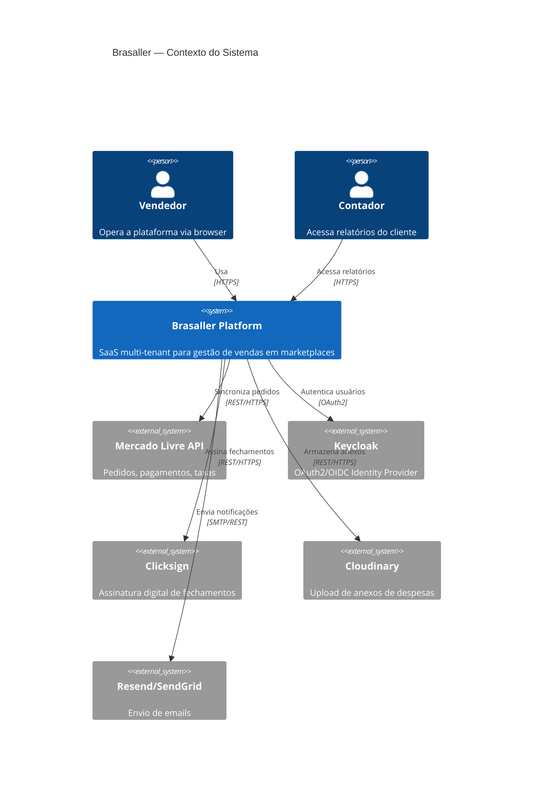
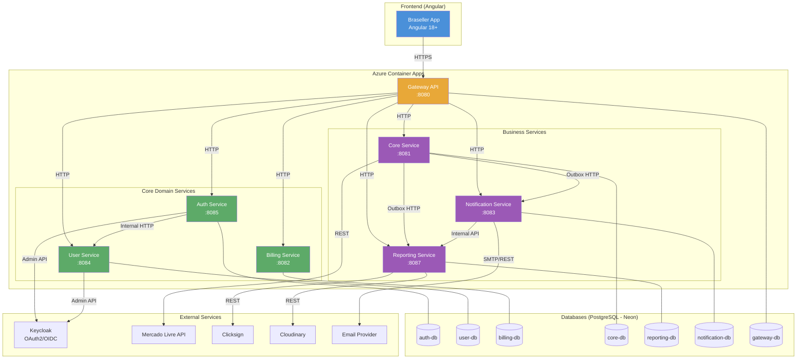
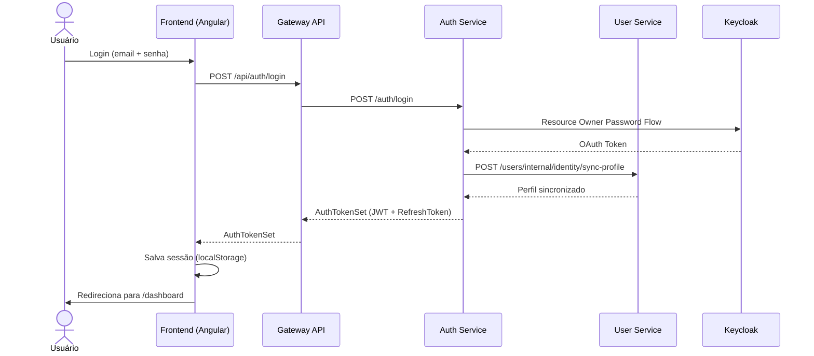
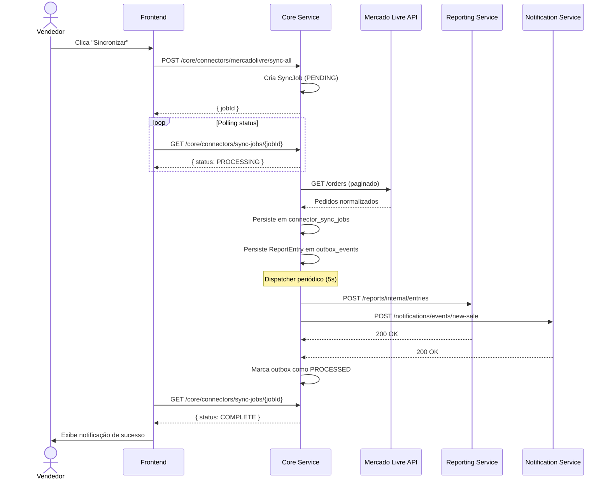

# Brasaller — Visão Geral da Arquitetura

## Equipe Responsável

| Engenheiro Full Stack | **Vinicius Moreira** |

---

## Resumo Executivo

**Brasaller** é uma plataforma SaaS multi-tenant para vendedores e contadores de e-commerce. Permite conectar marketplaces (Mercado Livre, Shopee, Amazon), consolidar vendas, gerar relatórios financeiros, calcular DRE e gerenciar fechamentos contábeis com assinatura digital.

## Stack Tecnológico

| Camada | Tecnologia |
|--------|-----------|
| Backend | Quarkus 3.35.4 · Java 21 |
| Frontend | Angular 18+ · TypeScript · RxJS |
| Banco de Dados | PostgreSQL (Neon) · Flyway |
| Auth | Keycloak (OAuth2/OIDC) · JWT |
| Infraestrutura | Azure Container Apps · Terraform |
| Email | Quarkus Mailer (Resend/SendGrid) |
| Armazenamento | Cloudinary (anexos) |
| Assinatura Digital | Clicksign |
| Observabilidade | Prometheus · Azure Log Analytics |

---

## Diagrama de Componentes (C4 Level 2)

---

## Diagrama de Arquitetura de Microserviços

---

## Padrões Arquiteturais

| Padrão | Aplicação |
|--------|-----------|
| **Microservices** | 7 serviços independentes com banco próprio |
| **API Gateway** | Ponto de entrada único; roteamento dinâmico |
| **Domain-Driven Design** | Cada serviço possui domínio e entidades próprias |
| **Multi-tenancy** | `tenant_id` em todas as tabelas; isolamento total |
| **Outbox Pattern** | Publicação confiável de eventos via tabela + dispatcher |
| **Event-Driven Realtime** | Log durável, replay por cursor, SSE e WebSocket ([detalhes](docs/realtime-connectors.md)) |
| **Connector Pattern** | Integrações de marketplace plugáveis |
| **Clean Architecture** | Separação: interfaces → application → domain → infrastructure |
| **Async Jobs** | Sync de pedidos e DRE via tabelas de job |
| **OAuth2/OIDC** | Keycloak como IdP centralizado |
| **IaC** | Terraform para deploy reproduzível no Azure |

---

## Fluxo de Autenticação

---

## Fluxo de Sincronização de Pedidos

---

## Módulos e Responsabilidades

| Serviço | Porta | Responsabilidade Principal |
|---------|-------|---------------------------|
| `gateway-api` | 8080 | Roteamento, CORS, proxy de requests |
| `auth-service` | 8085 | Login, registro, OAuth Google, JWT |
| `user-service` | 8084 | Tenants, usuários, roles, senhas |
| `billing-service` | 8082 | Planos, assinaturas, trial, webhooks |
| `core-service` | 8081 | Conectores de marketplace, pedidos, sync |
| `reporting-service` | 8087 | Dashboard, DRE, despesas, fechamento |
| `notification-service` | 8083 | Notificações in-app, emails, alertas |
| `apps/braseller` | 4200 | Frontend Angular do vendedor/contador |
