# High Level Architecture - Microservices BraSeller

Este documento desenha a arquitetura high level dos microservices atuais do repositorio e a logica principal de cada um. Os diagramas usam Mermaid/UML para serem renderizados no GitHub, IDEs compativeis ou em ferramentas Mermaid.

## Visao Geral

Padrao aplicado:

- Quarkus por microservice.
- Gateway HTTP unico em `/api`.
- Database-per-service com PostgreSQL e Flyway.
- Clean Architecture dentro dos servicos com `interfaces.rest`, `application`, `domain` e `infrastructure`.
- Identidade centralizada em `auth-service` + Keycloak, com `user-service` como fonte de tenants, usuarios e papeis.
- Comunicacao sincrona por REST onde ha consulta/comando direto.
- Comunicacao assincrona por Kafka para eventos de nova venda entre `core-service` e `notification-service`.
- Jobs do `notification-service` consultam o `reporting-service` por endpoints internos para montar fechamento mensal, alerta de liberacao ML e relatorio semanal ao contador.
- Nucleo fiscal da Fase 1 no `reporting-service`: regime tributario, despesas com comprovante Cloudinary obrigatorio, DRE simplificada e fechamento mensal assinado pelo contador.
- Observabilidade via `/q/health`, `/q/metrics`, Prometheus e Grafana.
- Evolucao funcional em duas versoes: MVP com integracao de marketplaces + complementos manuais, e versao completa com fiscal, estoque, custos, conciliacao bancaria e logistica integrados por APIs/adapters.

## Diagrama UML de Componentes

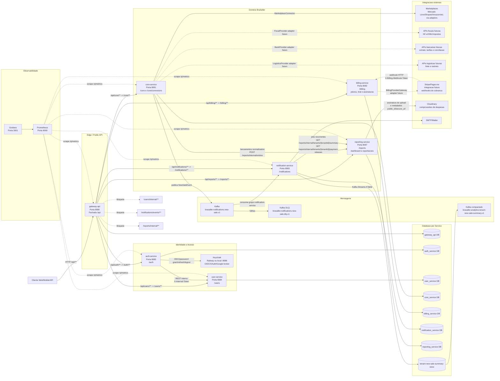

## Deployment High Level

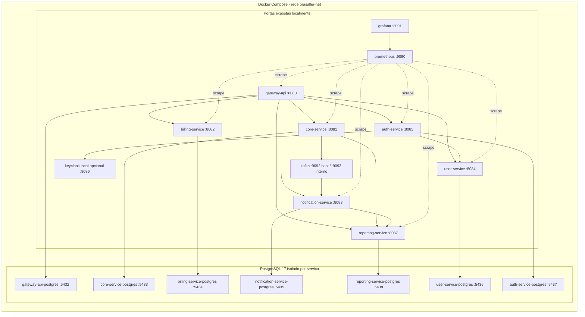

## Logica por Microservice

| Microservice | Responsabilidade | Logica principal | Saidas / dependencias | Persistencia |
| --- | --- | --- | --- | --- |
| `gateway-api` | Borda publica HTTP | Resolve o segmento `/api/{service}`, valida metodo, bloqueia paths internos e encaminha para downstream via REST Client. | REST para `auth`, `users`, `core`, `billing`, `notifications` e `reports`; propaga headers `Authorization`, `X-Tenant-Id`, `X-Request-Id`, `Accept`, `Content-Type` e `X-Billing-Webhook-Token`. | `gateway_api`, atualmente metadados/migrations base. |
| `auth-service` | Autenticacao e JWT da plataforma | Registra, autentica, renova e encerra sessoes. Usa Keycloak para credenciais/sessoes/OAuth e emite JWT interno com `tenant_id`, `user_id`, `roles/groups`. Sincroniza perfil com `user-service`. | Keycloak, `user-service` por `X-Internal-Token`, `TokenIssuer`, `AuthIdentityRepository`. | `auth_identities`, `auth_sessions`. |
| `user-service` | Fonte de tenants, usuarios, papeis e contador | Cria tenant e admin inicial, concede acesso `CONTADOR` read-only, lista membros, verifica senha e sincroniza perfil externo para uso interno do auth. | Valida JWT HS256 nos endpoints tenant-aware; aceita `X-Internal-Token` nos endpoints `/users/internal/**`. | `tenants`, `user_accounts`, `user_roles`, `accountant_access`. |
| `core-service` | Contexto tenant-aware e contratos de marketplace | Valida contexto JWT, aplica leitura/escrita por papel, resolve conector por nome, normaliza pedidos/pagamentos/taxas/notas e publica eventos de nova venda apos `sync-all`. Tokens de marketplace ficam criptografados e nunca retornam ao frontend. | Kafka topic `brasaller.notifications.new-sale.v1`; adapters `MarketplaceConnector`; hoje existem `sandbox` e `mercado-livre`. | `tenant_context_audit`, `marketplace_connector_tokens` com AES-256 e metadados base. |
| `notification-service` | Notificacoes, alertas, e-mail e analytics de venda | Gerencia preferencias por tenant, cria notificacoes in-app, envia e-mail quando habilitado, consome `NewSaleEvent`, mantem resumo por tenant via Kafka Streams/KTable e executa jobs automaticos de fechamento mensal, liberacao ML e relatorio semanal. | Kafka input, DLQ, Kafka Streams, SMTP/Mailer, `reporting-service` por REST interno, JWT HS256, `X-Internal-Token` para eventos internos. | `notification_preferences`, `notifications`, `notification_deliveries`, state store Kafka Streams. |
| `billing-service` | Planos, trial, assinaturas e cobranca recorrente | Lista planos `BASIC`, `PRO` e `AGENCY`, cria trial gratuito de 14 dias, consulta assinatura do tenant, permite upgrade/downgrade e aplica webhooks de ativacao/suspensao/cancelamento. | JWT HS256 nos endpoints tenant-aware; `X-Billing-Webhook-Token` em `/billing/webhooks`; `BillingProviderGateway` local hoje e adapter futuro para Stripe/Pagar.me. | `billing_plans`, `billing_subscriptions`, `billing_webhook_events`. |
| `reporting-service` | Painel financeiro, relatorios, fiscal MVP e exportacoes | Materializa lancamentos por tenant, soma faturado/recebido/taxas/a receber, oferece filtros, busca, ordenacao, tabela, graficos, exportacao PDF/XLSX/CSV, perfil fiscal, assinatura de upload Cloudinary, despesas com comprovante obrigatorio, DRE simplificada, fechamento mensal assinado e consultas internas para automacoes. | JWT HS256 para leitura; escrita fiscal por `ADMIN`/`VENDEDOR`; `CONTADOR` read-only e assinante do fechamento; `X-Internal-Token` em `/reports/internal/**` para ingestao e consultas service-to-service; renderizadores `ReportExportRenderer`. | `report_entries`, `tenant_fiscal_profiles`, `expense_entries`, `accounting_period_closings`. |

## Clean Architecture por Servico

```mermaid
flowchart TB
    subgraph Pattern["Padrao interno por microservice"]
        Rest["interfaces.rest<br/>Resources, DTO HTTP, exception mappers"]
        App["application<br/>Use cases, commands, services"]
        Domain["domain<br/>Modelos e conceitos de negocio"]
        Ports["application.port.out<br/>Contratos de saida"]
        Infra["infrastructure<br/>JDBC, REST client, JWT, Kafka, Mailer, Keycloak"]
        Store[("Banco / broker / servico externo")]

        Rest --> App
        App --> Domain
        App --> Ports
        Infra --> Ports
        Infra --> Store
    end

    subgraph GatewayImpl["gateway-api"]
        GatewayResource["GatewayResource"]
        GatewayRouting["GatewayRoutingService"]
        RouteCatalog["RouteCatalog"]
        DownstreamClient["DownstreamServiceClient"]
        ConfiguredRoutes["ConfiguredRouteCatalog"]
        RestClientDownstream["RestClientDownstreamServiceClient"]
        GatewayResource --> GatewayRouting
        GatewayRouting --> RouteCatalog
        GatewayRouting --> DownstreamClient
        ConfiguredRoutes --> RouteCatalog
        RestClientDownstream --> DownstreamClient
    end

    subgraph AuthImpl["auth-service"]
        AuthResource["AuthResource"]
        AuthenticationService["AuthenticationService"]
        KeycloakOAuthService["KeycloakOAuthService"]
        AuthRepo["AuthIdentityRepository"]
        UserGateway["UserIdentityGateway"]
        TokenIssuer["TokenIssuer"]
        KeycloakClient["KeycloakOAuthClient"]
        AuthResource --> AuthenticationService
        AuthResource --> KeycloakOAuthService
        AuthenticationService --> AuthRepo
        AuthenticationService --> UserGateway
        AuthenticationService --> TokenIssuer
        AuthenticationService --> KeycloakClient
    end

    subgraph UserImpl["user-service"]
        UserResource["UserResource"]
        UserIdentityService["UserIdentityService"]
        UserTenantAuth["TenantAuthorizationService"]
        UserRepo["UserIdentityRepository"]
        PasswordHasher["PasswordHasher"]
        InternalAuth["InternalServiceAuthorizer"]
        UserResource --> UserIdentityService
        UserResource --> UserTenantAuth
        UserIdentityService --> UserRepo
        UserIdentityService --> PasswordHasher
        UserIdentityService --> InternalAuth
    end

    subgraph CoreImpl["core-service"]
        CoreResource["CoreResource"]
        ConnectorResource["ConnectorResource"]
        TenantContextService["TenantContextService"]
        CoreTenantAuth["TenantAuthorizationService"]
        ConnectorService["ConnectorService"]
        ConnectorRegistry["ConnectorRegistry"]
        MarketplaceConnector["MarketplaceConnector"]
        DomainEventPublisher["DomainEventPublisher"]
        CoreResource --> TenantContextService
        ConnectorResource --> CoreTenantAuth
        ConnectorResource --> ConnectorService
        ConnectorService --> ConnectorRegistry
        ConnectorService --> MarketplaceConnector
        ConnectorService --> DomainEventPublisher
    end

    subgraph NotificationImpl["notification-service"]
        NotificationResource["NotificationResource"]
        NotificationTenantAuth["TenantAuthorizationService"]
        NotificationService["NotificationService"]
        ScheduledNotifications["ScheduledNotificationService"]
        NewSaleConsumer["NewSaleEventConsumer"]
        StreamsTopology["NewSaleStreamsTopology"]
        InteractiveQueries["NewSaleSummaryInteractiveQueries"]
        NotificationRepo["NotificationRepository"]
        ReportingDataProvider["ReportingDataProvider"]
        ReportingClient["RestReportingDataProvider"]
        EmailSender["NotificationEmailSender"]
        NotificationResource --> NotificationTenantAuth
        NotificationResource --> NotificationService
        NotificationResource --> InteractiveQueries
        NewSaleConsumer --> NotificationService
        StreamsTopology --> InteractiveQueries
        ScheduledNotifications --> NotificationRepo
        ScheduledNotifications --> NotificationService
        ScheduledNotifications --> ReportingDataProvider
        ReportingClient --> ReportingDataProvider
        NotificationService --> NotificationRepo
        NotificationService --> EmailSender
    end

    subgraph BillingImpl["billing-service"]
        BillingResource["BillingResource"]
        BillingTenantAuth["TenantAuthorizationService"]
        BillingService["BillingService"]
        BillingRepository["BillingRepository"]
        BillingProviderGateway["BillingProviderGateway"]
        BillingJwtVerifier["Hs256JwtContextVerifier"]
        WebhookAuthorizer["ConfiguredBillingWebhookAuthorizer"]
        LocalBillingProvider["LocalBillingProviderGateway"]
        BillingResource --> BillingTenantAuth
        BillingResource --> BillingService
        BillingResource --> WebhookAuthorizer
        BillingTenantAuth --> BillingJwtVerifier
        BillingService --> BillingRepository
        BillingService --> BillingProviderGateway
        LocalBillingProvider --> BillingProviderGateway
    end

    subgraph ReportingImpl["reporting-service"]
        ReportingResource["ReportingResource"]
        ReportingTenantAuth["TenantAuthorizationService"]
        ReportingService["ReportingService"]
        ReportExportService["ReportExportService"]
        ReportEntryRepository["ReportEntryRepository"]
        ExportRenderers["PDF/XLSX/CSV ReportExportRenderer"]
        JwtVerifier["Hs256JwtContextVerifier"]
        InternalAuthorizer["ConfiguredInternalServiceAuthorizer"]
        ReportingResource --> ReportingTenantAuth
        ReportingResource --> ReportingService
        ReportingResource --> ReportExportService
        ReportingResource --> InternalAuthorizer
        ReportingTenantAuth --> JwtVerifier
        ReportingService --> ReportEntryRepository
        ReportExportService --> ReportingService
        ReportExportService --> ReportEntryRepository
        ReportExportService --> ExportRenderers
    end
```

## Classes Principais

```mermaid
classDiagram
    class GatewayRoutingService {
      +forward(GatewayRequest) GatewayResponse
      +routes() List
      -hasUnsafePathSegment(String) boolean
    }

    class AuthenticationService {
      +register(RegisterCommand) AuthTokenSet
      +login(LoginCommand) AuthTokenSet
      +refresh(RefreshTokenCommand) AuthTokenSet
      +logout(RefreshTokenCommand) boolean
      +loginOrRegisterWithKeycloak(KeycloakIdentity,String,KeycloakTokenResponse) AuthTokenSet
    }

    class UserIdentityService {
      +registerTenant(RegisterTenantCommand) RegisteredTenant
      +grantAccountantAccess(GrantAccountantAccessCommand) AccountantAccessView
      +listTenantMembers(String) List
      +verifyPassword(String,VerifyPasswordCommand) Optional
      +syncExternalProfile(String,SyncExternalProfileCommand) Optional
    }

    class ConnectorService {
      +list() List
      +authenticate(String,String,Map) ConnectorToken
      +refreshToken(String,String,String) ConnectorToken
      +getOrders(String,String,LocalDate,LocalDate,OrderStatus,Integer) List
      +syncAll(String,String,String,Instant) SyncResult
      +getStatus(String,String) ConnectorStatus
    }

    class NotificationService {
      +getPreference(String) NotificationPreference
      +updatePreference(UpdateNotificationPreferenceCommand) NotificationPreference
      +list(String,Integer) List
      +markAsRead(String,String) Optional
      +archiveRead(String) int
      +notifyNewSale(NewSaleNotificationCommand) Optional
      +notifyMlPaymentRelease(MlPaymentReleaseNotificationCommand) Optional
      +sendMonthlyClosing(MonthlyClosingNotificationCommand) Optional
      +sendWeeklyAccountantReport(WeeklyAccountantReportCommand) Optional
    }

    class BillingService {
      +plans() List
      +subscription(String) BillingSubscription
      +startTrial(StartTrialCommand) BillingSubscription
      +changePlan(ChangePlanCommand) BillingSubscription
      +applyWebhook(BillingWebhookCommand) BillingSubscription
      -statusFor(BillingWebhookEventType) SubscriptionStatus
    }

    class ReportingService {
      +dashboard(String,ReportFilter) DashboardView
      +summary(String,ReportFilter) FinancialSummary
      +entries(String,ReportFilter) ReportEntryPage
      +monthlyEvolution(String,ReportFilter) List
      +platformComparison(String,ReportFilter) List
      +filters(String) AvailableFilters
      +upsert(UpsertReportEntryCommand) ReportEntry
    }

    class ReportExportService {
      +exportMonthly(String,YearMonth,ReportExportFormat) ReportExportFile
      +exportPlatform(String,String,LocalDate,LocalDate,ReportExportFormat) ReportExportFile
      -export(String,String,String,String,ReportFilter,ReportExportFormat) ReportExportFile
    }

    class MarketplaceConnector {
      <<interface>>
      +name() String
      +descriptor() ConnectorDescriptor
      +authenticate(ConnectorAuthenticationCommand) ConnectorToken
      +refreshToken(ConnectorRefreshTokenCommand) ConnectorToken
      +getOrders(String,OrderFilters) List
      +getOrderDetail(String,String) StandardOrder
      +getPayments(String,String) List
      +getFees(String,String) List
      +getInvoices(String,InvoiceFilters) List default opcional
      +syncAll(String,Instant) SyncResult
      +getStatus(String) ConnectorStatus
    }

    class SandboxMarketplaceConnector
    MarketplaceConnector <|.. SandboxMarketplaceConnector

    GatewayRoutingService ..> AuthenticationService : encaminha via REST
    GatewayRoutingService ..> UserIdentityService : encaminha via REST
    GatewayRoutingService ..> ConnectorService : encaminha via REST
    GatewayRoutingService ..> BillingService : encaminha via REST
    GatewayRoutingService ..> NotificationService : encaminha via REST
    GatewayRoutingService ..> ReportingService : encaminha via REST
    ReportExportService ..> ReportingService : consulta agregados
    ConnectorService ..> MarketplaceConnector : usa porta
    ConnectorService ..> NotificationService : publica evento Kafka consumido por
    AuthenticationService ..> UserIdentityService : sync/register via REST interno
```

## Fluxo UML - Registro de Tenant e Login Inicial

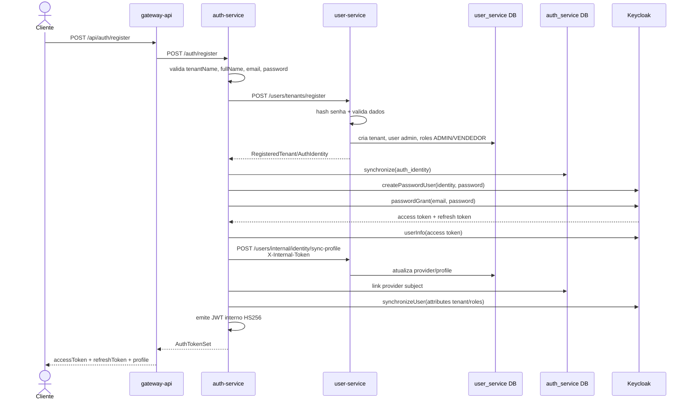

## Fluxo UML - Login, Refresh e Logout

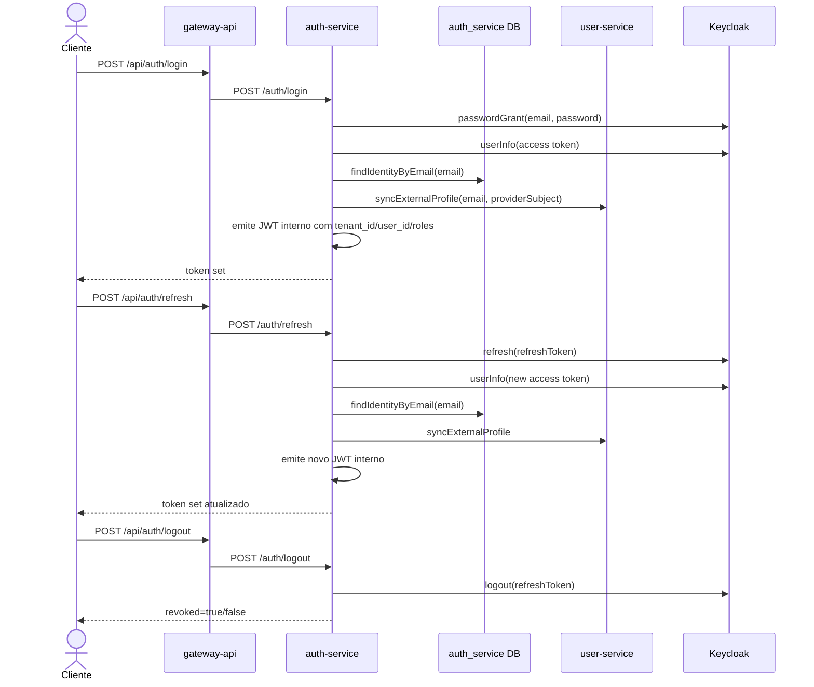

## Fluxo UML - Contexto Tenant-Aware e Papeis

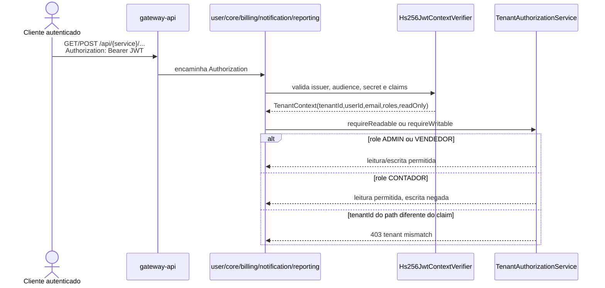

## Fluxo UML - Sincronizacao de Marketplace e Notificacao por Evento

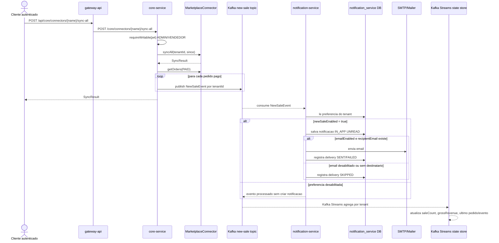

## Fluxo UML - Operacao Comercial em Duas Versoes

### Versao 1 - MVP

Objetivo: entregar valor rapido com pedidos, pagamentos, taxas, custos manuais e relatorios. O sistema importa automaticamente o que o marketplace disponibiliza e complementa internamente o que nao vem da plataforma.

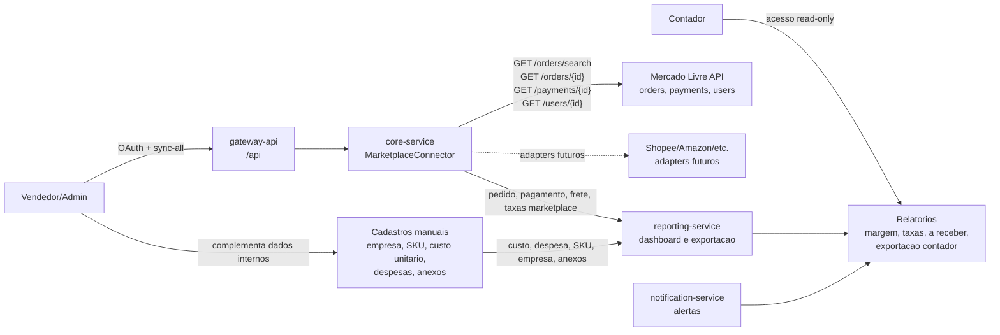

Escopo funcional do MVP:

- Cadastro de empresa com regime tributario informado manualmente: Simples, Lucro Presumido ou Lucro Real.
- Cadastro simples de produto/SKU e custo unitario para calculo de margem.
- Importacao automatica de pedidos, itens, pagamentos, taxas, frete e status quando a API do marketplace disponibilizar.
- Lancamento manual de custos operacionais, taxas bancarias, insumos, embalagem, mao de obra e outras despesas.
- Status do pedido puxado do marketplace e status interno simples para etapas operacionais.
- Cancelamento, devolucao, avaria e perda registrados como status/movimentacao manual quando a API nao informar.
- Comprovantes obrigatorios em despesas manuais, armazenados no Cloudinary e validados pelo contador.

### Versao 2 - Completa / Evolutiva

Objetivo: evoluir o MVP para uma operacao mais parecida com ERP/financeiro, com integracoes fiscais, estoque, conciliacao bancaria e logistica.

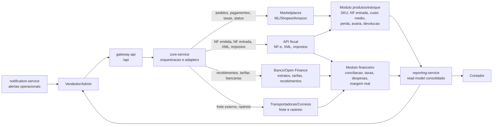

Escopo funcional evolutivo:

- Importacao de XML/NF de entrada para alimentar estoque, custo de aquisicao e documentos fiscais.
- Consulta/ingestao de NF emitida para capturar impostos reais da venda quando o provedor fiscal disponibilizar.
- Controle de estoque por SKU com entrada, saida por venda, devolucao, perda, avaria e ajuste.
- Conciliacao bancaria por API ou importacao de extrato para tarifas bancarias, recebimentos e divergencias.
- Regras fiscais parametrizadas por regime tributario e apoio ao contador nos relatorios.
- Frete, seguro, descontos, outras despesas da NF e custos extras como componentes do pedido/lancamento financeiro.
- Workflow operacional completo: pago, separacao, NF emitida, expedicao, enviado, recebido, cancelado, devolvido, avariado ou perdido.

Decisao de arquitetura: APIs externas entram sempre como adapters nas camadas de infraestrutura. A camada de aplicacao continua falando por portas internas, evitando acoplamento direto com Mercado Livre, provedor fiscal, banco ou transportadora.

## Fluxo UML - Consulta de Notificacoes e Resumo de Vendas

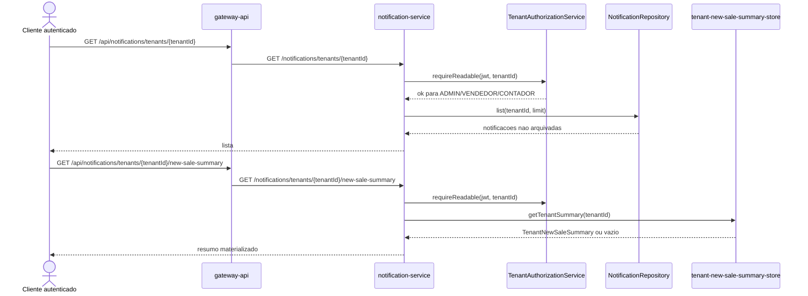

## Fluxo UML - Jobs Automaticos de Notificacao

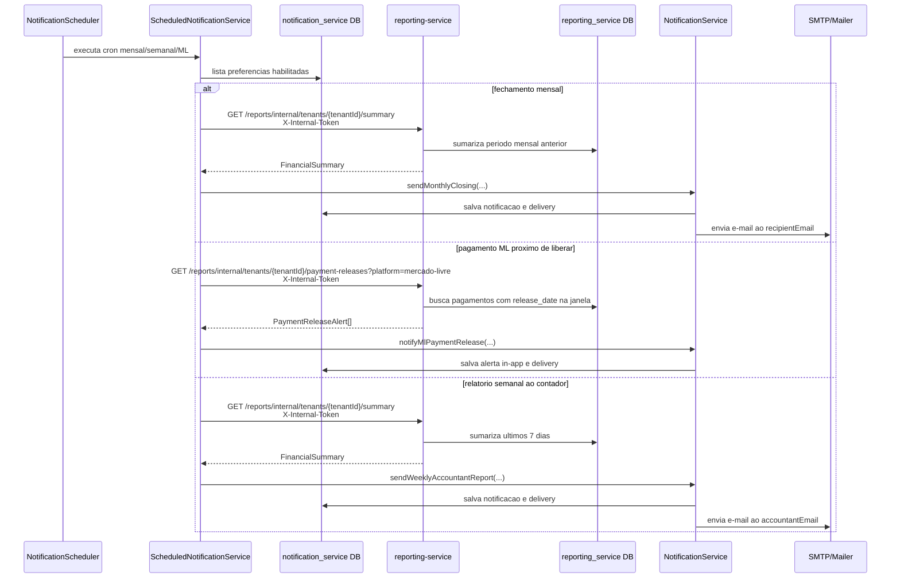

## Fluxo UML - Cobranca, Trial e Assinaturas

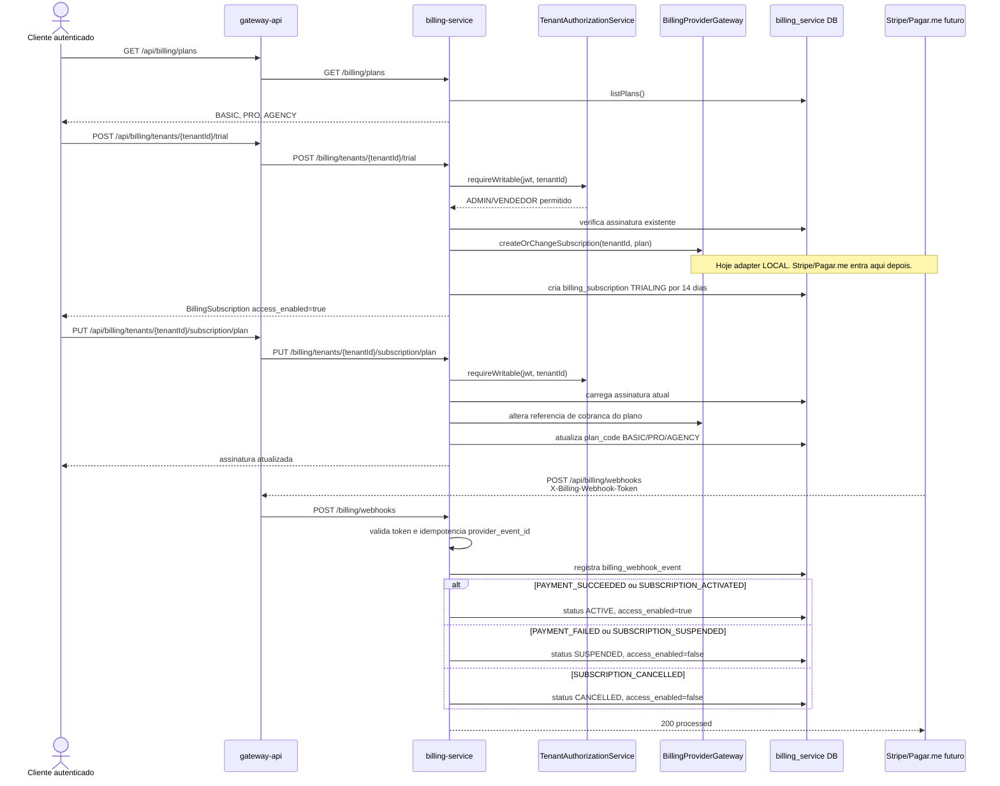

## Fluxo UML - Reporting, Ingestao e Exportacao

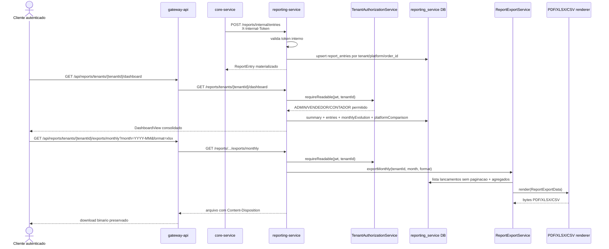

## Fluxo UML - Acesso do Contador

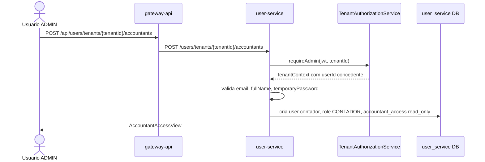

## Seguranca e Contratos

- O cliente publico entra pelo `gateway-api`.
- O gateway expoe rotas publicas, mas bloqueia:
  - `/api/users/internal/**`
  - `/api/notifications/events/**`
  - `/api/reports/internal/**`
- `/api/billing/webhooks` fica publico para provedores de cobranca, mas exige `X-Billing-Webhook-Token`.
- Endpoints tenant-aware derivam o tenant do JWT, nao de query/body/header.
- Claims relevantes do JWT interno:
  - `tenant_id`
  - `user_id`
  - `email`
  - `roles`
  - `groups`
- Papeis:
  - `ADMIN`: leitura e escrita, incluindo acesso de contador.
  - `VENDEDOR`: leitura e escrita operacional.
  - `CONTADOR`: leitura no proprio tenant; escrita bloqueada quando nao houver `ADMIN`.
- Chamadas internas usam `X-Internal-Token`; webhooks de cobranca usam `X-Billing-Webhook-Token`.
- Keycloak cuida de credenciais, refresh token, logout e OAuth; o JWT usado pelos microservices e emitido pelo `auth-service`.

## Topicos Kafka

| Topico | Produtor | Consumidor | Uso |
| --- | --- | --- | --- |
| `brasaller.notifications.new-sale.v1` | `core-service` | `notification-service` e Kafka Streams | Evento de nova venda apos `sync-all`. |
| `brasaller.notifications.new-sale.dlq.v1` | SmallRye Kafka failure strategy | Operacao/observabilidade | Dead-letter de falhas no consumo. |
| `brasaller.analytics.tenant-new-sale-summary.v1` | Kafka Streams no `notification-service` | Analytics/consultas futuras | Saida compactada do resumo de vendas por tenant. |

No estado atual, `billing-service` e `reporting-service` nao publicam nem consomem Kafka diretamente. Billing recebe webhooks HTTP de cobranca; Reporting materializa seu read model por endpoint interno protegido. Se esses fluxos passarem a ser assincronos, os topicos devem ser novos e orientados ao dominio, nao reaproveitar `brasaller.notifications.new-sale.v1`.

## Dados por Servico

```mermaid
erDiagram
    TENANTS ||--o{ USER_ACCOUNTS : possui
    TENANTS ||--o{ USER_ROLES : define
    USER_ACCOUNTS ||--o{ USER_ROLES : recebe
    USER_ACCOUNTS ||--o{ ACCOUNTANT_ACCESS : contador

    AUTH_IDENTITIES ||--o{ AUTH_SESSIONS : possui

    NOTIFICATION_PREFERENCES ||--o{ NOTIFICATIONS : configura
    NOTIFICATIONS ||--o{ NOTIFICATION_DELIVERIES : registra
    BILLING_PLANS ||--o{ BILLING_SUBSCRIPTIONS : define
    BILLING_SUBSCRIPTIONS ||--o{ BILLING_WEBHOOK_EVENTS : atualiza
    TENANTS ||--o{ REPORT_ENTRIES : materializa
    TENANTS ||--|| TENANT_FISCAL_PROFILES : configura
    TENANTS ||--o{ EXPENSE_ENTRIES : lanca
    TENANTS ||--o{ ACCOUNTING_PERIOD_CLOSINGS : assina
    TENANTS ||--o{ BILLING_SUBSCRIPTIONS : assina
    TENANTS ||--o{ MARKETPLACE_CONNECTOR_TOKENS : autentica

    TENANTS {
        string id PK
        string legal_name
        string trade_name
        string status
    }
    USER_ACCOUNTS {
        string id PK
        string tenant_id FK
        string email
        string full_name
        string provider
        string status
    }
    USER_ROLES {
        string tenant_id PK
        string user_id PK
        string role PK
    }
    ACCOUNTANT_ACCESS {
        string id PK
        string tenant_id FK
        string accountant_user_id FK
        string granted_by_user_id FK
        boolean read_only
    }
    AUTH_IDENTITIES {
        string id PK
        string tenant_id
        string user_id
        string email
        string roles
        string provider
    }
    AUTH_SESSIONS {
        string id PK
        string tenant_id
        string user_id
        string token_id
        string refresh_token_hash
    }
    NOTIFICATION_PREFERENCES {
        string tenant_id PK
        boolean email_enabled
        boolean new_sale_enabled
        boolean monthly_closing_enabled
        boolean ml_payment_release_enabled
        boolean weekly_accountant_report_enabled
        string recipient_email
        string accountant_email
    }
    NOTIFICATIONS {
        string id PK
        string tenant_id
        string type
        string title
        string status
    }
    NOTIFICATION_DELIVERIES {
        string id PK
        string notification_id FK
        string channel
        string status
    }
    BILLING_PLANS {
        string code PK
        string name
        decimal monthly_price
        string currency
        int trial_days
        int marketplace_limit
        int user_limit
    }
    BILLING_SUBSCRIPTIONS {
        string id PK
        string tenant_id
        string plan_code FK
        string status
        string provider
        string provider_customer_id
        string provider_subscription_id
        timestamp trial_ends_at
        timestamp current_period_ends_at
    }
    BILLING_WEBHOOK_EVENTS {
        string id PK
        string provider
        string provider_event_id
        string tenant_id
        string event_type
        string status
    }
    REPORT_ENTRIES {
        string id PK
        string tenant_id
        string platform
        string order_id
        date sale_date
        decimal gross_value
        decimal received_value
        decimal fee_value
        decimal receivable_value
        string payment_method
        string status
        date release_date
    }
    TENANT_FISCAL_PROFILES {
        string tenant_id PK
        string tax_regime
        decimal estimated_tax_rate
        string notes
    }
    EXPENSE_ENTRIES {
        string id PK
        string tenant_id
        date expense_date
        string category
        string description
        decimal amount
        string attachment_public_id
        string attachment_secure_url
    }
    ACCOUNTING_PERIOD_CLOSINGS {
        string tenant_id PK
        date period_month PK
        string signed_by_user_id
        string signed_by_email
        string signature_hash
        timestamp signed_at
    }
    MARKETPLACE_CONNECTOR_TOKENS {
        string tenant_id PK
        string connector_name PK
        string seller_id
        string access_token_encrypted
        string refresh_token_encrypted
        timestamp expires_at
        timestamp updated_at
    }
```

## Observacoes de Estado Atual

- `auth-service`, `user-service`, `core-service`, `billing-service`, `notification-service`, `reporting-service` e `gateway-api` possuem logica de negocio implementada em Clean Architecture.
- `billing-service` possui dominio inicial de planos, trial, assinatura e webhooks. A integracao real com Stripe/Pagar.me ainda deve substituir o adapter `LocalBillingProviderGateway`.
- `reporting-service` possui read model financeiro, endpoints de dashboard/graficos/tabela, nucleo fiscal MVP com regime tributario, despesas com comprovante Cloudinary obrigatorio, DRE simplificada e fechamento contabil assinado, alem de motor unico de exportacao PDF/XLSX/CSV.
- Nao foi criado microservice novo para fiscal/contabil na Fase 1; o escopo atual depende diretamente do read model do `reporting-service`. Um servico dedicado passa a fazer sentido quando houver apuracao fiscal propria, NF-e/SPED, conciliacao bancaria ou workflow contabil independente.
- Campos monetarios persistidos usam `DECIMAL(10,2)`; tipos de ponto flutuante sao proibidos para transacoes financeiras.
- Os conectores de marketplace implementados sao `sandbox` e `mercado-livre`; novos marketplaces devem entrar como adapters em `core-service/src/main/java/com/example/infrastructure/connector` implementando `MarketplaceConnector`.
- O conector `mercado-livre` usa OAuth 2.0, persiste tokens por tenant em `marketplace_connector_tokens` com AES-256, renova token automaticamente antes do vencimento e normaliza pedidos, pagamentos, taxas, frete e datas para o contrato padrao do Core. O frontend trafega somente o `code` OAuth, nunca tokens da plataforma.
- Eventos internos de notificacao existem por REST (`/notifications/events/**`), o caminho preferido para nova venda ja e Kafka a partir do `core-service`, e os alertas recorrentes consultam `reporting-service` por contrato interno.
- Kafka hoje nao e usado diretamente por `billing-service` nem `reporting-service`.
