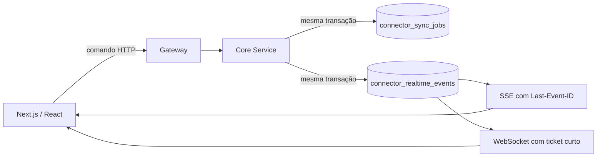

# Conectores realtime com Event-Driven Architecture

## Decisão

O estado dos conectores é distribuído como eventos duráveis e tenant-aware.
SSE é o transporte padrão para atualizações servidor → navegador. WebSocket é
usado quando o ambiente oferece uma URL pública com upgrade HTTP e quando a
comunicação bidirecional é útil. Os dois transportes leem o mesmo cursor.



## Garantias

- Entrega `at-least-once`: eventos podem ser repetidos após uma reconexão.
- Sem perda durante desconexões dentro da janela de retenção: o cliente retoma
  usando o último `sequence` confirmado.
- Ordem por tenant: `sequence_id` é monotônico e a consulta usa ordem crescente.
- Idempotência no cliente: eventos com `sequence` menor ou igual ao cursor local
  são descartados.
- Isolamento multi-tenant: o tenant vem do JWT no SSE/replay e do ticket assinado
  no WebSocket.
- Estado e evento do job são atômicos: `QUEUED`, `PROCESSING`, `COMPLETED` e
  `FAILED` são gravados no mesmo commit da alteração de `connector_sync_jobs`.

## Endpoints

| Método | Endpoint | Uso |
| --- | --- | --- |
| `GET` | `/core/connectors/events` | Stream SSE; aceita `cursor` e `Last-Event-ID` |
| `GET` | `/core/connectors/events/replay` | Replay JSON para diagnóstico/recuperação |
| `POST` | `/core/connectors/realtime-ticket` | Ticket curto para abrir WebSocket |
| `WS` | `/core/connectors/events/ws/{ticket}/{cursor}` | Stream bidirecional |

O Next.js expõe `/api/realtime/connectors` como proxy autenticado para o
`gateway-api`. Isso mantém o JWT em cookie `HttpOnly`. O gateway possui
endpoints dedicados que preservam o stream SSE e fazem relay bidirecional do
WebSocket para o Core privado.

## Reconexão no cliente

1. O cliente solicita um ticket/configuração.
2. Tenta WebSocket quando há URL pública configurada.
3. Após falhas consecutivas, usa SSE automaticamente.
4. Em qualquer reconexão, envia o cursor salvo por tenant.
5. O backend reproduz os eventos posteriores ao cursor.
6. O cliente persiste o novo cursor somente após processar o evento.

## Infraestrutura

Configurações principais:

```text
GATEWAY_URL=https://gateway-api.example.com
CORE_REALTIME_WS_PUBLIC_URL=wss://gateway-api.example.com/api/core/connectors/events/ws
REALTIME_TICKET_SECRET=<segredo-forte>
REALTIME_POLL_INTERVAL=750ms
REALTIME_BATCH_SIZE=500
REALTIME_RETENTION_DAYS=7
```

O ingress do SSE deve desabilitar buffering e manter timeouts superiores ao
heartbeat de 15 segundos. A rota WebSocket precisa permitir `Connection:
Upgrade` e `Upgrade: websocket`.

## Evolução para maior escala

A implementação atual usa PostgreSQL como log durável e polling curto. Ela é
adequada enquanto o volume de conexões e eventos é moderado. A porta
`ConnectorRealtimeEventStore` permite substituir a propagação por Redis Streams,
Kafka ou Redpanda sem mudar o contrato do cliente:

- PostgreSQL continua sendo o source of truth/transacional outbox.
- CDC/Debezium ou dispatcher publica no broker.
- consumidores por instância fazem fan-out local para SSE/WebSocket.
- offsets do broker substituem o polling, preservando replay e idempotência.

Não use apenas pub/sub efêmero para esse fluxo: sem log e cursor, uma queda entre
publicação e reconexão perde o evento.
