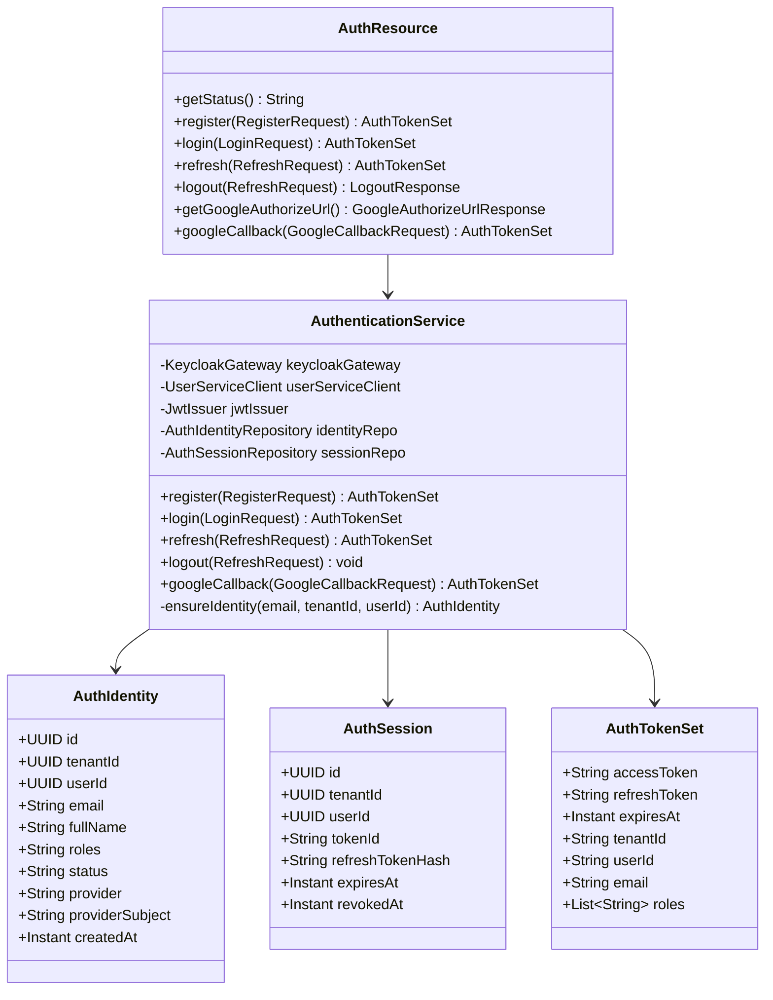
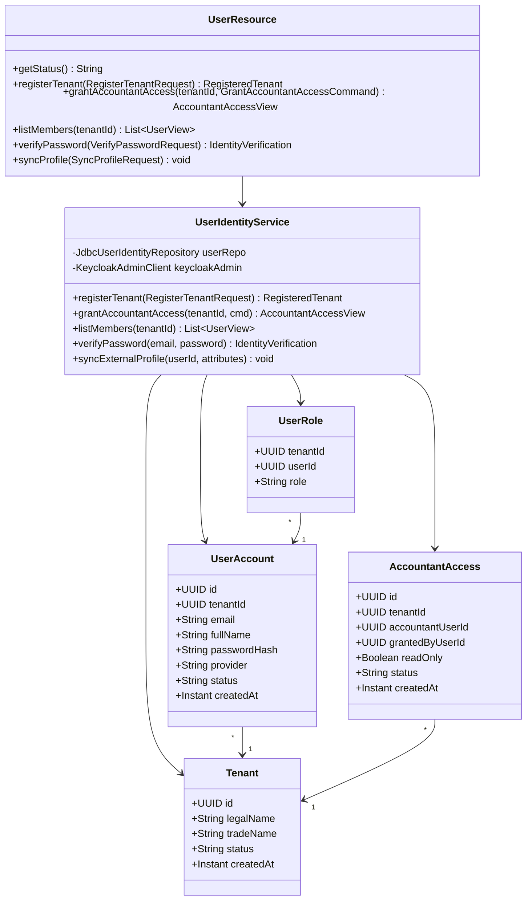
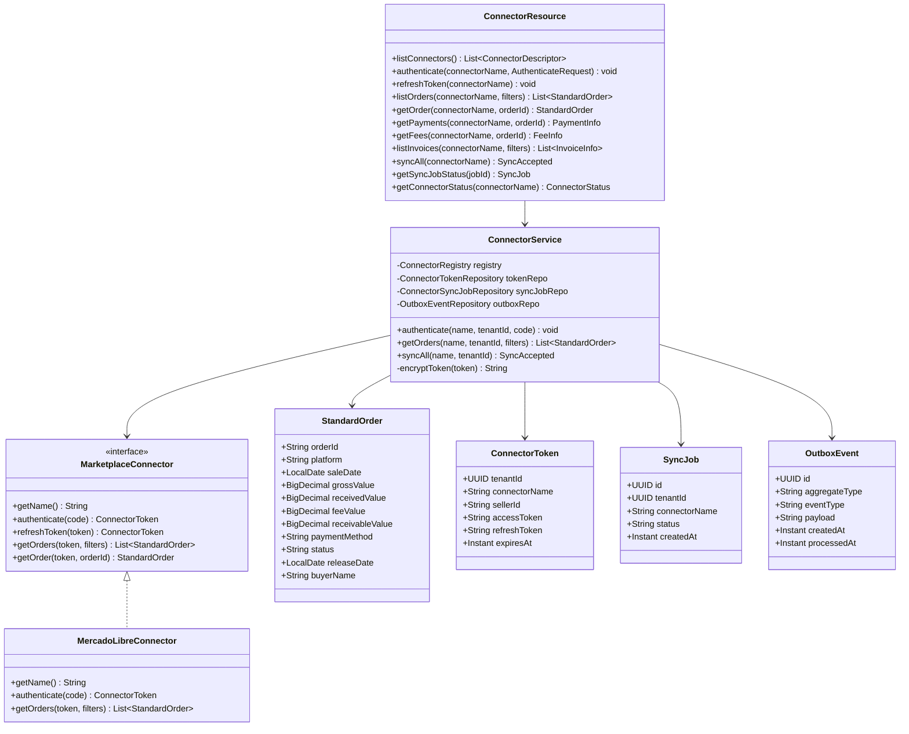
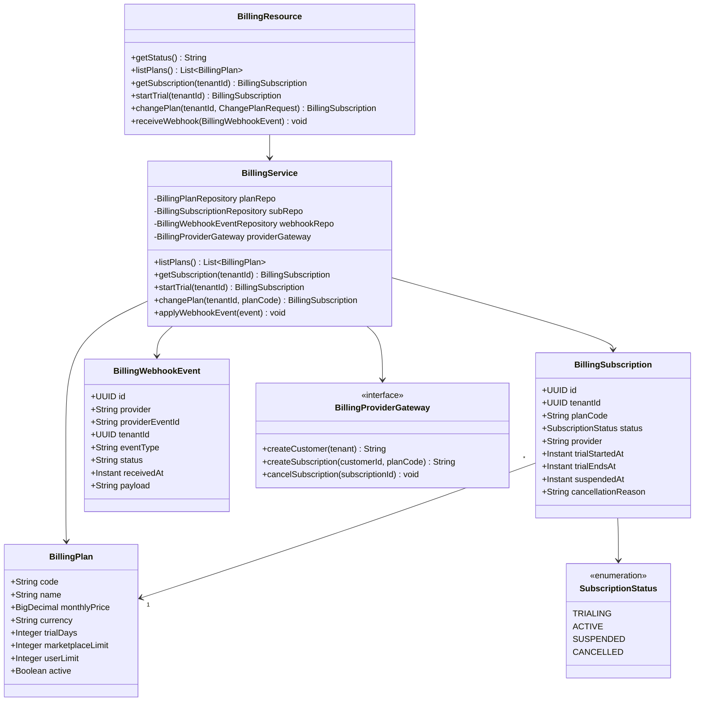
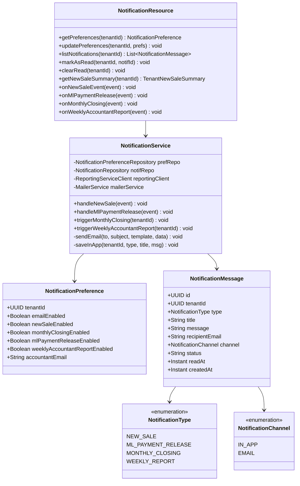
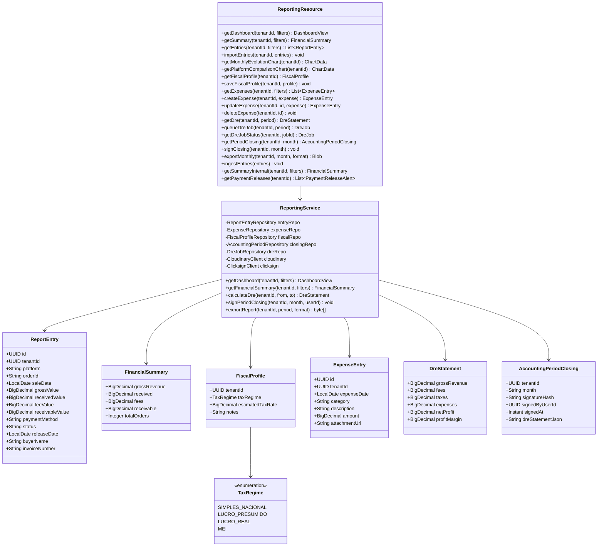
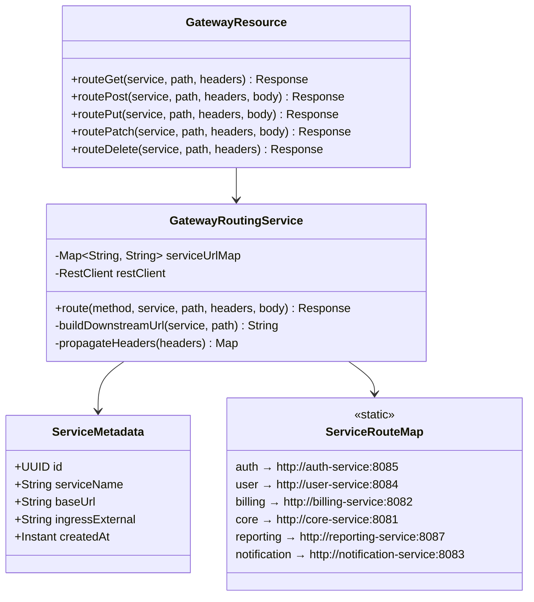
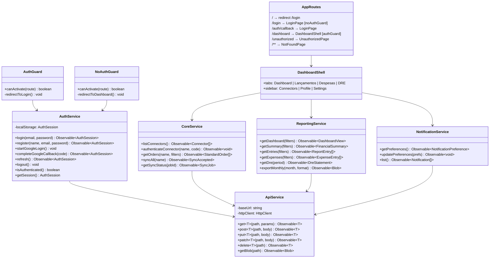
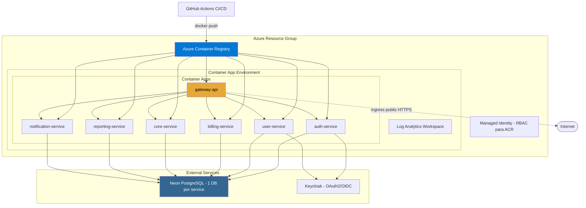

# UML dos Microserviços — Diagrama de Classes e Componentes

## 1. Auth Service

---

## 2. User Service

---

## 3. Core Service (Conectores de Marketplace)

---

## 4. Billing Service

---

## 5. Notification Service

---

## 6. Reporting Service

---

## 7. Gateway API

---

## 8. Frontend Angular — Estrutura de Módulos

---

## Diagrama de Deployment (Azure)

