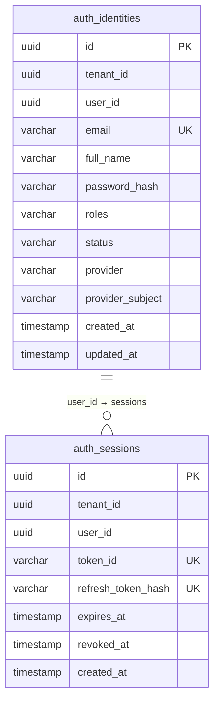
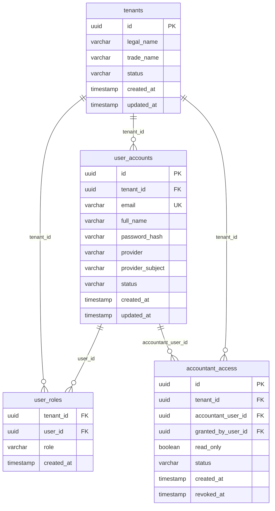
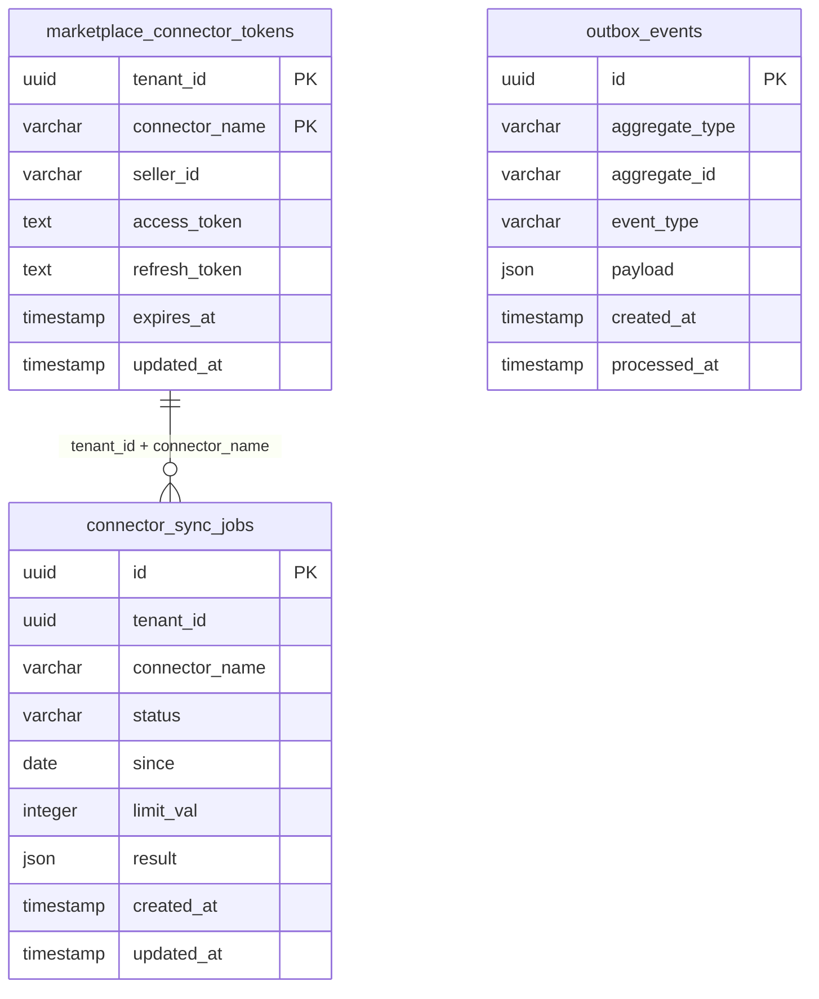
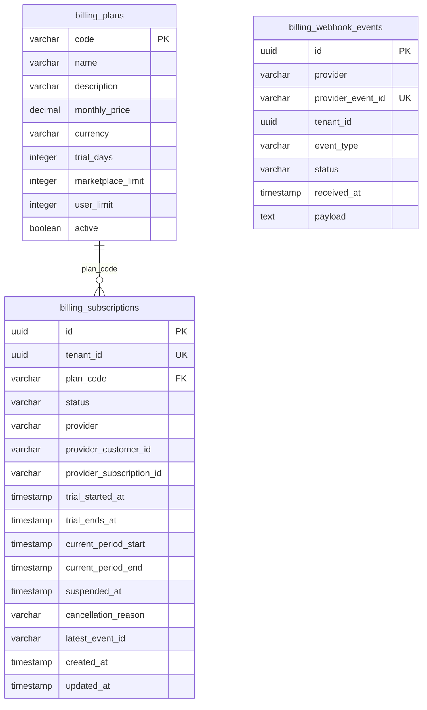
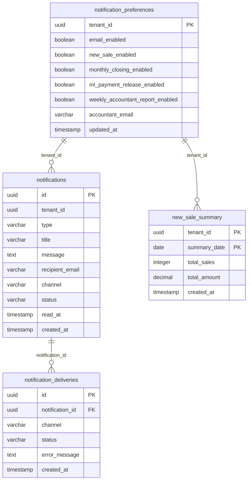
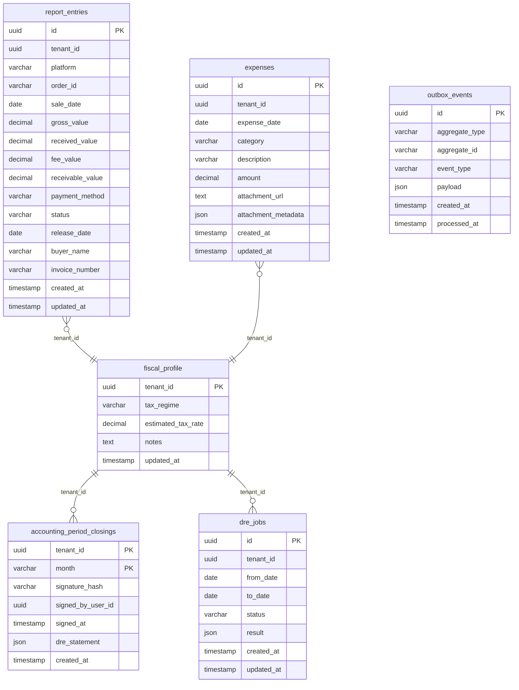
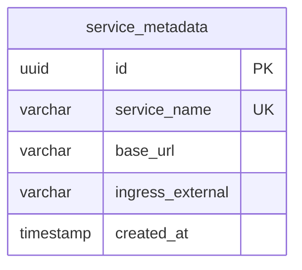
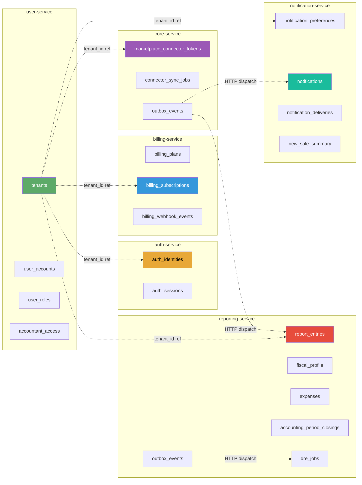

# Diagrama de Entidades e Relacionamentos (ERD)

Cada microserviço possui seu próprio banco PostgreSQL (database-per-service). Os relacionamentos entre serviços são gerenciados pela aplicação, não por foreign keys cross-database.

---

## Auth Service Database

---

## User Service Database

---

## Core Service Database

---

## Billing Service Database

---

## Notification Service Database

---

## Reporting Service Database

---

## Gateway API Database

---

## Visão Consolidada dos Domínios (Cross-Service)

---

## Tabelas por Serviço — Resumo

| Serviço | Tabelas | Observações |
|---------|---------|-------------|
| auth-service | auth_identities, auth_sessions | JWT, OAuth, Keycloak sync |
| user-service | tenants, user_accounts, user_roles, accountant_access | Multi-tenant identity |
| billing-service | billing_plans, billing_subscriptions, billing_webhook_events | Assinaturas, trial 14 dias |
| core-service | marketplace_connector_tokens, connector_sync_jobs, outbox_events | Tokens AES-256, jobs async |
| reporting-service | report_entries, fiscal_profile, expenses, accounting_period_closings, dre_jobs, outbox_events | Núcleo financeiro |
| notification-service | notification_preferences, notifications, notification_deliveries, new_sale_summary | Email + in-app |
| gateway-api | service_metadata | Mapa de roteamento |
