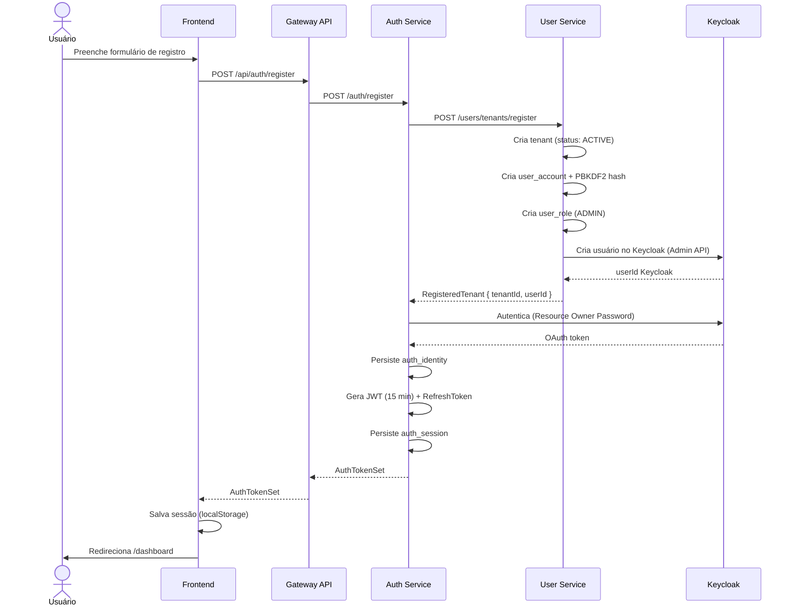
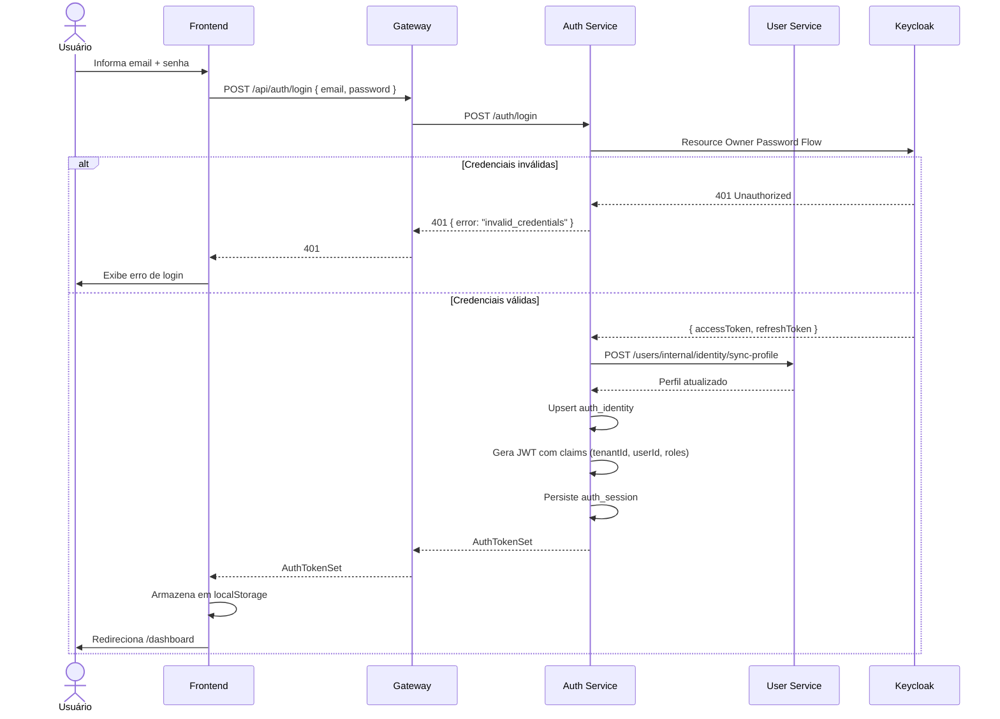
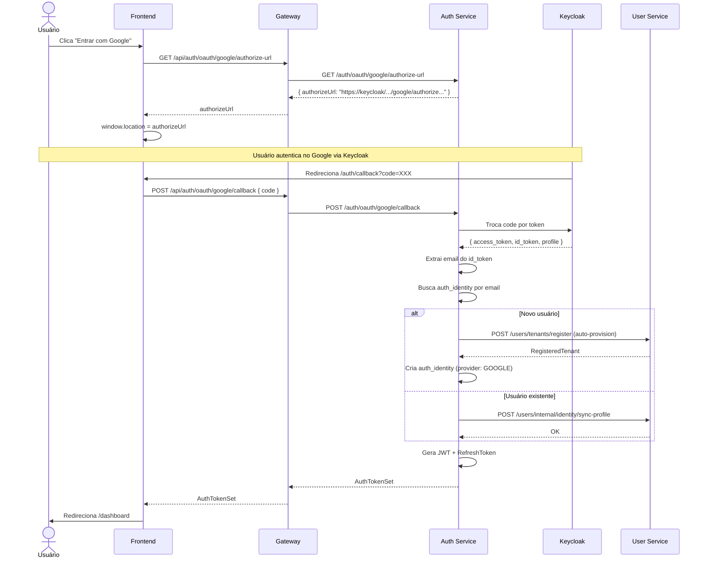
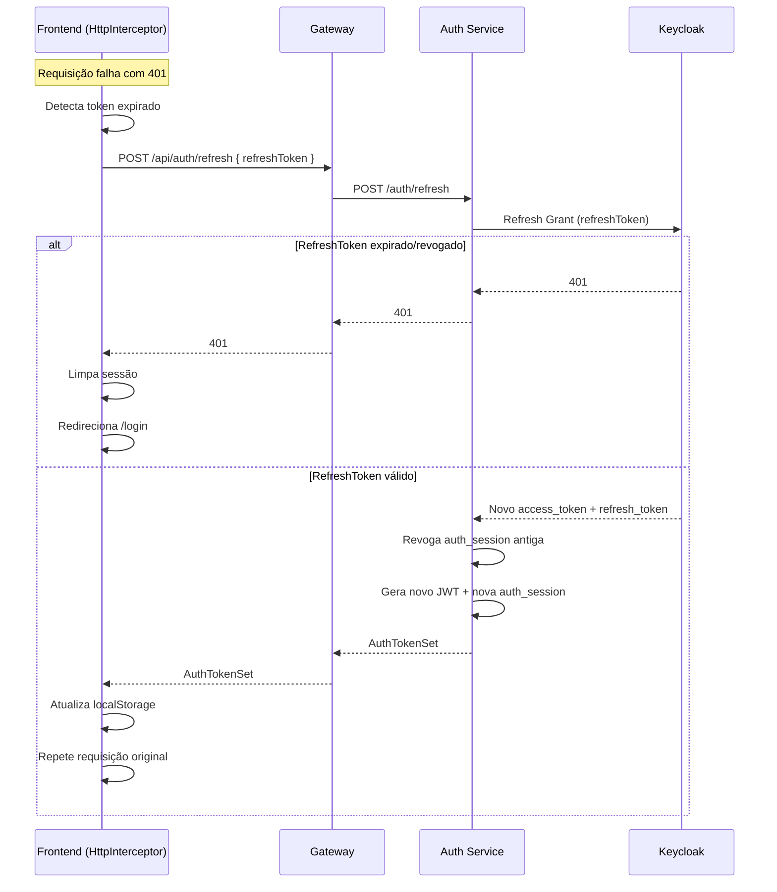
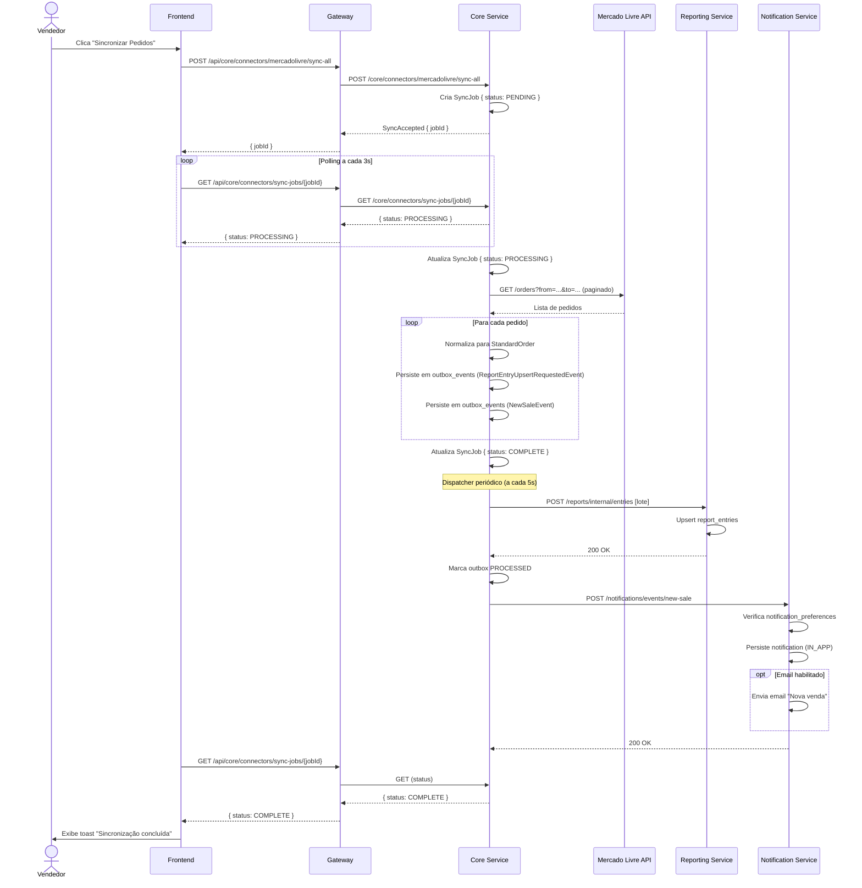
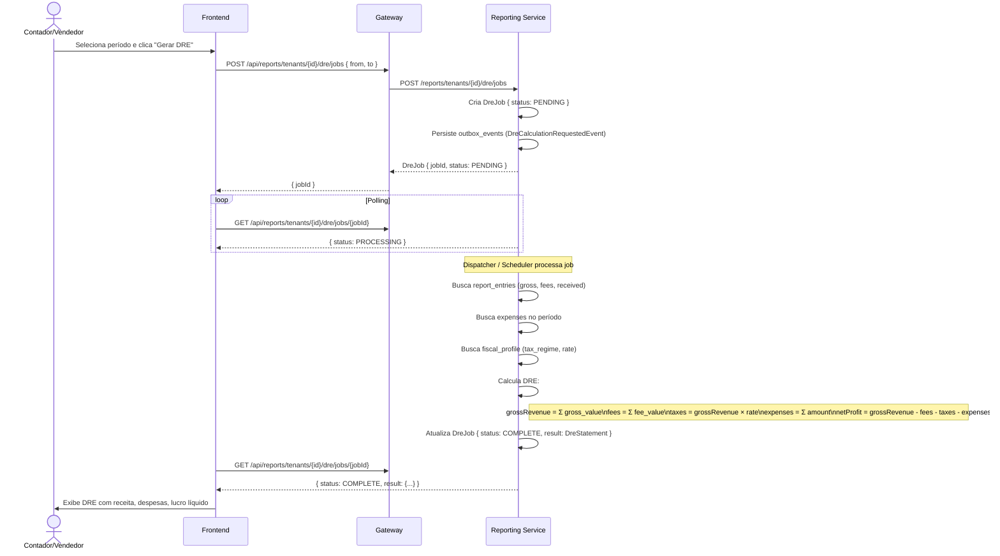
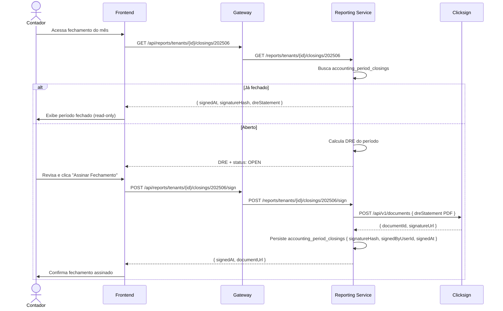
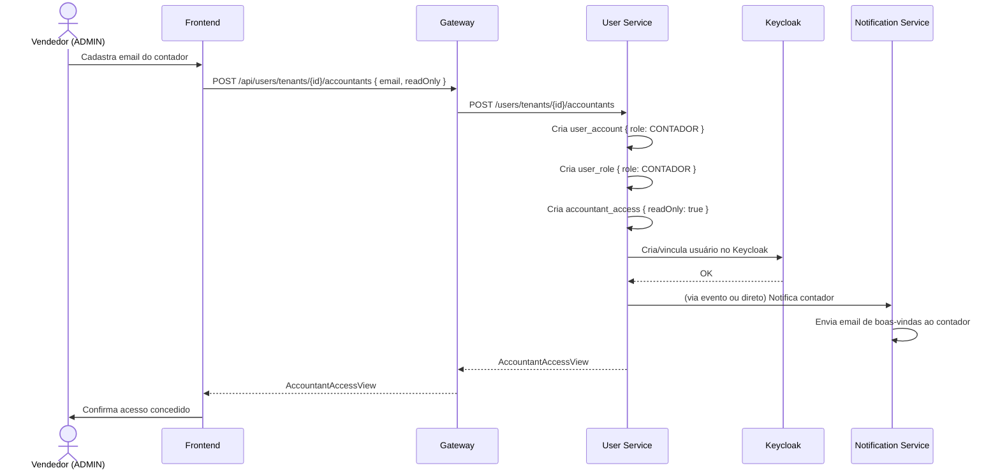
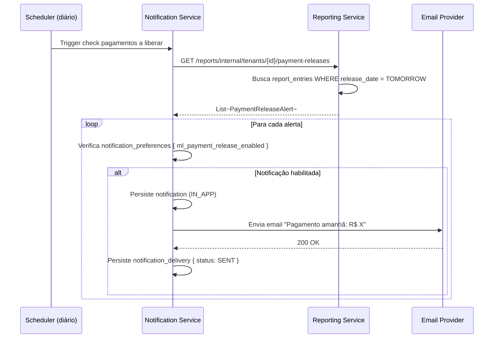
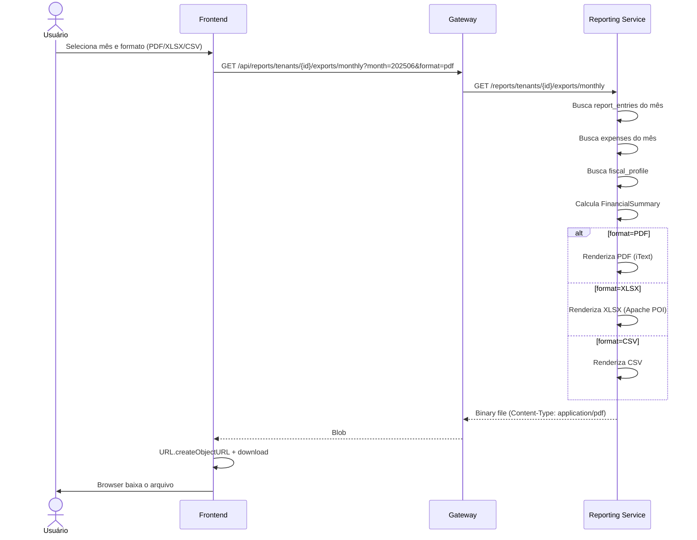

# Diagramas de Sequência — Fluxos Principais

## 1. Registro de Novo Tenant (Onboarding)

---

## 2. Login com Email e Senha

---

## 3. Login com Google OAuth

---

## 4. Refresh de Token

---

## 5. Sincronização de Pedidos (Mercado Livre)

---

## 6. Geração de DRE (Demonstração do Resultado)

---

## 7. Fechamento Contábil com Assinatura Digital

---

## 8. Concessão de Acesso ao Contador

---

## 9. Alerta de Liberação de Pagamento ML

---

## 10. Exportação de Relatório (PDF/XLSX/CSV)

