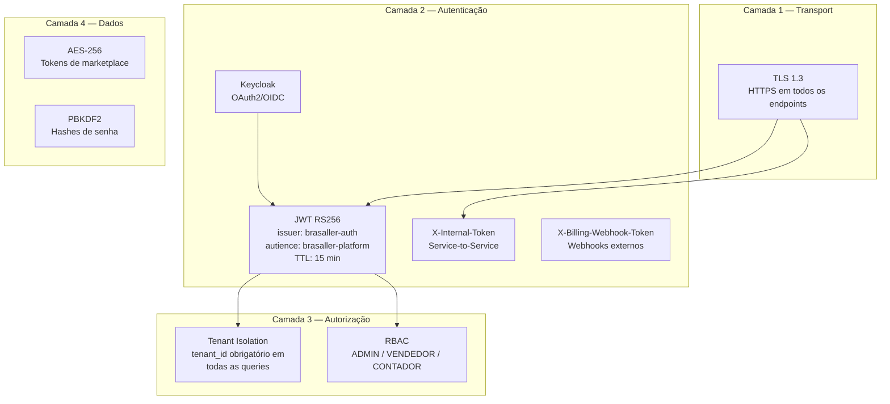
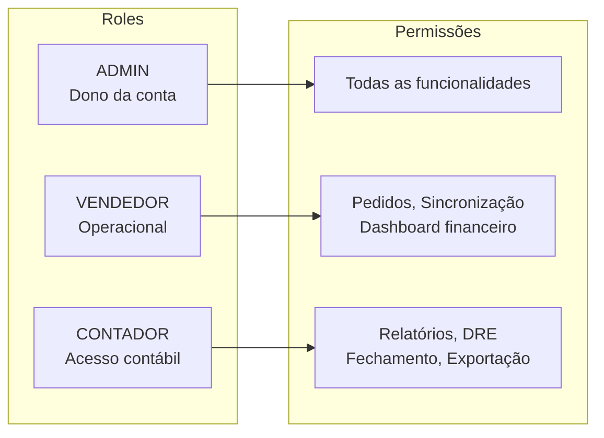
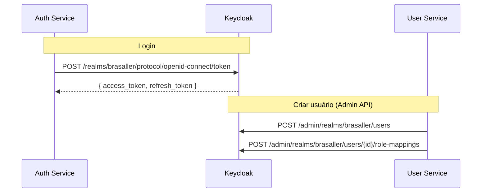
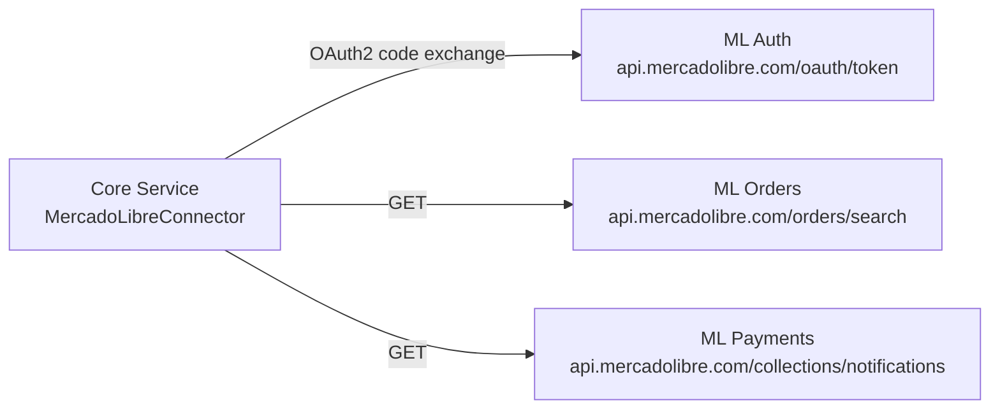
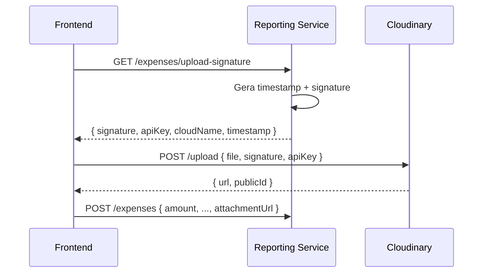
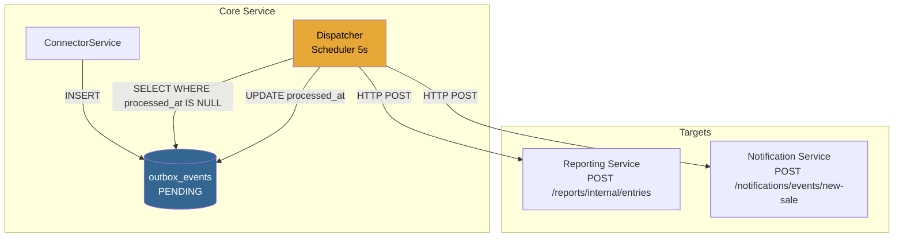

# Segurança e Integrações Externas

## Modelo de Segurança

### Camadas de Proteção



---

### Fluxo de Autorização por Role



---

## Integrações Externas

### 1. Keycloak (Identity Provider)

| Aspecto | Detalhe |
|---------|---------|
| **Protocolo** | OAuth2 / OIDC |
| **Flows usados** | Resource Owner Password, Authorization Code (Google), Admin API |
| **Uso no auth-service** | Login, register, refresh, Google OAuth broker |
| **Uso no user-service** | Admin API para criar/gerenciar usuários e roles |
| **TTL token** | Configurável (padrão Keycloak) |
| **Realm** | `brasaller` (dedicado) |



---

### 2. Mercado Livre API

| Aspecto | Detalhe |
|---------|---------|
| **Auth** | OAuth2 Authorization Code |
| **Tokens** | access_token (6h) + refresh_token (longo prazo), AES-256 encrypted no DB |
| **Endpoints consumidos** | /orders, /payments, /invoices, /fees |
| **Connector** | `MercadoLibreConnector` (implementa `MarketplaceConnector`) |
| **Normalização** | Transforma resposta ML → `StandardOrder` |



---

### 3. Cloudinary (Armazenamento de Anexos)

| Aspecto | Detalhe |
|---------|---------|
| **Uso** | Upload de comprovantes/recibos de despesas |
| **Auth** | API Key + Secret (signed uploads) |
| **Endpoint** | `GET /reports/tenants/{id}/expenses/upload-signature` retorna assinatura temporária |
| **Fluxo** | Frontend faz upload direto para Cloudinary usando assinatura do backend |



---

### 4. Clicksign (Assinatura Digital)

| Aspecto | Detalhe |
|---------|---------|
| **Uso** | Assinatura de fechamentos contábeis mensais |
| **Auth** | API Key via Authorization header |
| **Webhooks** | `POST /reports/webhooks/clicksign` recebe eventos de assinatura |
| **Fluxo** | Backend envia PDF → Clicksign → Contador assina → Webhook confirma |

---

### 5. Email Provider (Resend / SendGrid)

| Aspecto | Detalhe |
|---------|---------|
| **Framework** | Quarkus Mailer (SMTP / API) |
| **Templates** | Qute (HTML templating) |
| **Emails enviados** | Nova venda, Liberação de pagamento ML, Fechamento mensal, Relatório semanal contador |
| **Configuração** | `MAILER_HOST`, `MAILER_PORT`, `MAILER_USER`, `MAILER_PASSWORD` |

---

## Outbox Pattern — Garantia de Entrega de Eventos



**Garantias:**
- Atomicidade: insert na tabela de negócio + outbox na mesma transaction
- At-least-once delivery: retry em caso de falha HTTP
- Idempotência: targets devem tolerar duplicatas (upsert por `order_id + platform`)

---

## Variáveis de Ambiente por Serviço

### Variáveis Comuns (todos os serviços)

| Variável | Descrição | Exemplo |
|----------|-----------|---------|
| `HTTP_PORT` | Porta do serviço | `8080` |
| `DB_JDBC_URL` | JDBC connection string | `jdbc:postgresql://neon.tech/auth` |
| `DB_USERNAME` | Usuário do banco | `auth-service` |
| `DB_PASSWORD` | Senha do banco | `(secret)` |
| `LOG_LEVEL` | Nível de log | `INFO` |
| `LOG_JSON` | Log em JSON (produção) | `true` |
| `CORS_ORIGINS` | Origens CORS permitidas | `https://app.brasaller.com.br` |
| `SWAGGER_UI_ENABLED` | Habilita Swagger UI | `false` (prod) |

### Auth Service

| Variável | Descrição |
|----------|-----------|
| `AUTH_JWT_SECRET` | Segredo de assinatura JWT (min 256 bits) |
| `AUTH_JWT_TTL_SECONDS` | TTL do access token (padrão: 900) |
| `KEYCLOAK_BASE_URL` | URL base do Keycloak |
| `KEYCLOAK_REALM` | Realm Keycloak |
| `KEYCLOAK_CLIENT_ID` | Client ID OAuth2 |
| `KEYCLOAK_CLIENT_SECRET` | Client Secret OAuth2 |
| `INTERNAL_SERVICE_TOKEN` | Token para chamadas internas |
| `USER_SERVICE_URL` | URL do user-service |

### Core Service

| Variável | Descrição |
|----------|-----------|
| `ML_CLIENT_ID` | App ID Mercado Livre |
| `ML_CLIENT_SECRET` | App Secret Mercado Livre |
| `ML_REDIRECT_URI` | OAuth redirect URI |
| `TOKEN_ENCRYPTION_KEY` | Chave AES-256 para tokens |
| `REPORTING_SERVICE_URL` | URL do reporting-service |
| `NOTIFICATION_SERVICE_URL` | URL do notification-service |

### Reporting Service

| Variável | Descrição |
|----------|-----------|
| `CLOUDINARY_CLOUD_NAME` | Cloud name Cloudinary |
| `CLOUDINARY_API_KEY` | API Key Cloudinary |
| `CLOUDINARY_API_SECRET` | API Secret Cloudinary |
| `CLICKSIGN_API_KEY` | API Key Clicksign |
| `CLICKSIGN_BASE_URL` | URL base Clicksign |

### Notification Service

| Variável | Descrição |
|----------|-----------|
| `MAILER_HOST` | SMTP host |
| `MAILER_PORT` | SMTP port (587) |
| `MAILER_FROM` | Email remetente |
| `MAILER_USERNAME` | SMTP / API user |
| `MAILER_PASSWORD` | SMTP / API key |
| `REPORTING_SERVICE_URL` | URL do reporting-service |

### Billing Service

| Variável | Descrição |
|----------|-----------|
| `BILLING_WEBHOOK_TOKEN` | Token para validar webhooks |
| `STRIPE_API_KEY` | Stripe API key (se usado) |
| `STRIPE_WEBHOOK_SECRET` | Stripe webhook secret |

---

## Health Checks e Observabilidade

### Endpoints de Saúde (Quarkus SmallRye Health)

| Endpoint | Tipo | Descrição |
|----------|------|-----------|
| `/q/health/live` | Liveness | Serviço está vivo |
| `/q/health/ready` | Readiness | Dependências (DB) OK |
| `/q/health` | Combined | Liveness + Readiness |
| `/q/metrics` | Prometheus | Métricas HTTP, JVM, DB pool |

### Azure Container Apps — Probes

```
livenessProbe:
  httpGet:
    path: /q/health/live
    port: 8080
  initialDelaySeconds: 10
  periodSeconds: 30

readinessProbe:
  httpGet:
    path: /q/health/ready
    port: 8080
  initialDelaySeconds: 5
  periodSeconds: 15
```

### Logging Estruturado (JSON)

```json
{
  "timestamp": "2026-06-03T14:30:00.000Z",
  "level": "INFO",
  "logger": "com.example.AuthenticationService",
  "message": "User login successful",
  "tenantId": "uuid",
  "userId": "uuid",
  "requestId": "trace-id",
  "durationMs": 145
}
```
