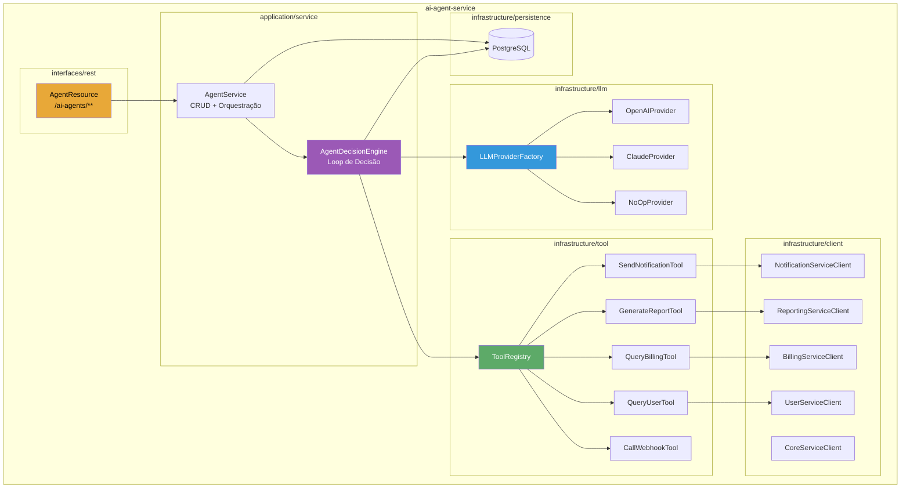
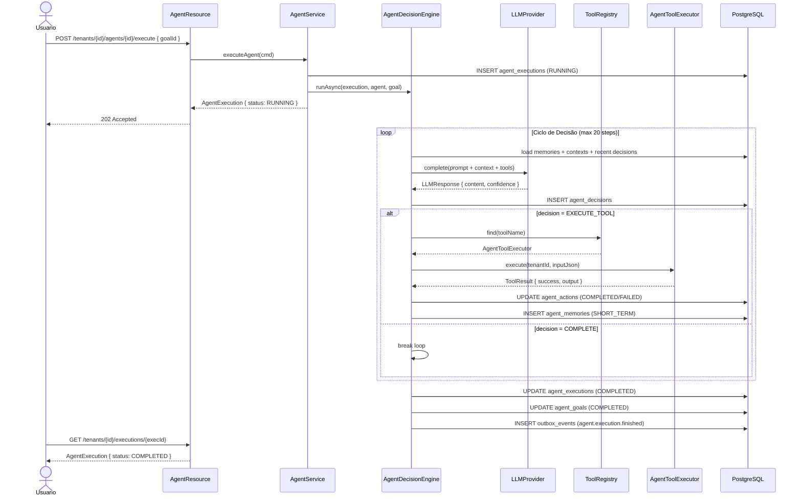
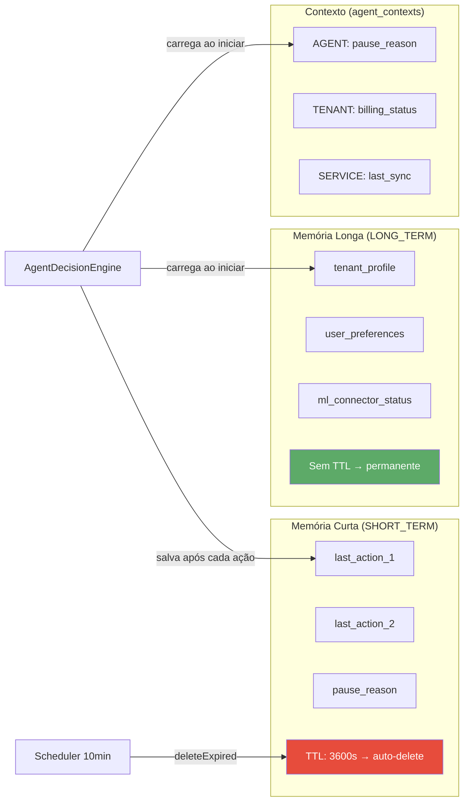
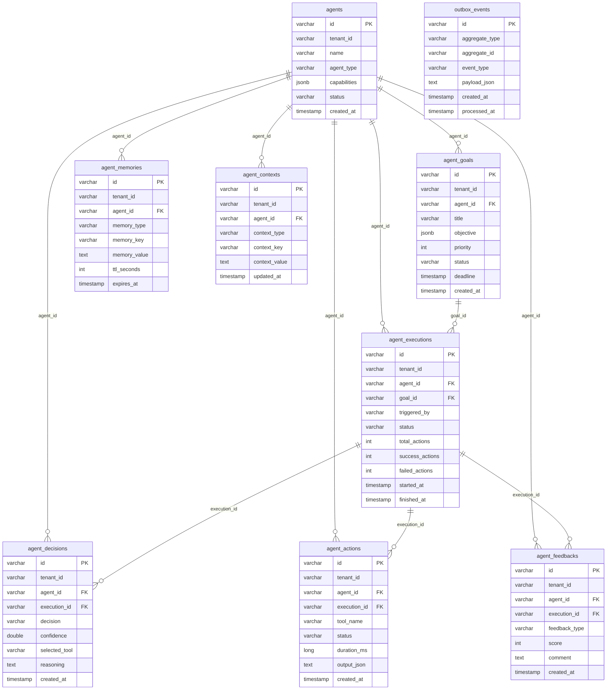
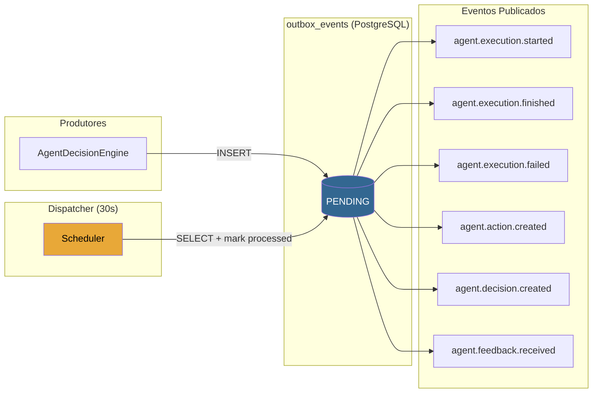
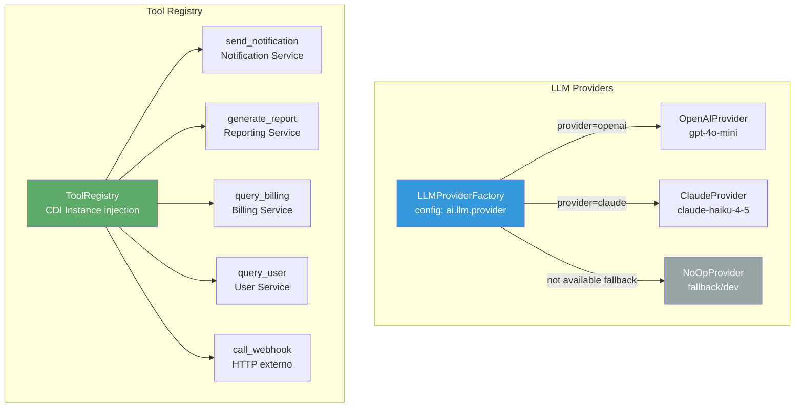

# AI Agent Service — Documentação Técnica

## Equipe

| Papel | Nome |
|-------|------|
| Agencia de Desenvolvimento | **Clarituz** |
| CEO | **Jerferson** |
| Engenheiro Full Stack | **Vinicius Moreira** |

---

## Visão Geral

O `ai-agent-service` é um microserviço autônomo de IA integrado à plataforma Brasaller. Ele permite criar **agentes inteligentes** que percebem o contexto do sistema, tomam decisões, executam ferramentas dos demais microserviços e aprendem com o histórico de execuções.

| Atributo | Valor |
|----------|-------|
| **Porta (dev)** | 8086 |
| **Porta (prod)** | 8080 |
| **Framework** | Quarkus 3.35.4 / Java 21 |
| **Banco** | PostgreSQL (Neon) — `ai-agent-service-db` |
| **Migrations** | Flyway |
| **Arquitetura** | Hexagonal (Ports & Adapters) |

---

## Diagrama de Arquitetura do Microserviço



---

## Fluxo de Decisão do Agente



---

## Fluxo de Memória



---

## Diagrama de Entidades (ERD)



---

## Diagrama de Eventos (Outbox)



---

## Ferramentas e LLM Providers



---

## Integração com Microserviços

```mermaid
graph LR
    AI[ai-agent-service]

    AI -->|POST /notifications/events/agent-action| NS[notification-service]
    AI -->|GET /reports/internal/tenants/{id}/summary| RS[reporting-service]
    AI -->|GET /billing/tenants/{id}/subscription| BS[billing-service]
    AI -->|GET /users/tenants/{id}/members| US[user-service]
    AI -->|GET /core/connectors| CS[core-service]

    GW[gateway-api] -->|proxy| AI

    style AI fill:#9B59B6,color:#fff
    style GW fill:#E8A838,color:#000
```

---

## REST Endpoints

| Método | Path | Descrição | Auth |
|--------|------|-----------|------|
| `GET` | `/ai-agents` | Status do serviço | — |
| `POST` | `/ai-agents/tenants/{id}/agents` | Criar agente | JWT ADMIN |
| `GET` | `/ai-agents/tenants/{id}/agents` | Listar agentes | JWT |
| `GET` | `/ai-agents/tenants/{id}/agents/{agentId}` | Consultar agente | JWT |
| `POST` | `/ai-agents/tenants/{id}/agents/{agentId}/pause` | Pausar agente | JWT ADMIN |
| `POST` | `/ai-agents/tenants/{id}/agents/{agentId}/resume` | Retomar agente | JWT ADMIN |
| `POST` | `/ai-agents/tenants/{id}/agents/{agentId}/goals` | Criar objetivo | JWT |
| `GET` | `/ai-agents/tenants/{id}/agents/{agentId}/goals` | Listar objetivos | JWT |
| `POST` | `/ai-agents/tenants/{id}/agents/{agentId}/execute` | Executar agente | JWT |
| `GET` | `/ai-agents/tenants/{id}/agents/{agentId}/executions` | Histórico execuções | JWT |
| `GET` | `/ai-agents/tenants/{id}/executions/{execId}` | Status execução | JWT |
| `GET` | `/ai-agents/tenants/{id}/agents/{agentId}/memory` | Consultar memória | JWT |
| `POST` | `/ai-agents/tenants/{id}/agents/{agentId}/memory` | Armazenar memória | JWT |
| `GET` | `/ai-agents/tenants/{id}/executions/{execId}/decisions` | Decisões tomadas | JWT |
| `POST` | `/ai-agents/tenants/{id}/agents/{agentId}/actions` | Ação manual | JWT ADMIN |
| `POST` | `/ai-agents/tenants/{id}/agents/{agentId}/feedback` | Registrar feedback | JWT |
| `GET` | `/ai-agents/tenants/{id}/agents/{agentId}/feedback` | Listar feedbacks | JWT |

---

## Variáveis de Ambiente

| Variável | Descrição | Padrão |
|----------|-----------|--------|
| `HTTP_PORT` | Porta HTTP | `8086` |
| `DB_JDBC_URL` | URL JDBC PostgreSQL | `jdbc:postgresql://localhost:5432/ai-agent-service` |
| `DB_USERNAME` | Usuário do banco | `ai-agent-service` |
| `DB_PASSWORD` | Senha do banco | — |
| `AI_JWT_SECRET` | Segredo JWT (min 32 chars) | — |
| `AI_JWT_ISSUER` | Issuer esperado no JWT | `brasaller-auth` |
| `AI_INTERNAL_TOKEN` | Token service-to-service | — |
| `AI_LLM_PROVIDER` | Provider ativo: `noop`, `openai`, `claude` | `noop` |
| `AI_LLM_OPENAI_API_KEY` | Chave OpenAI | — |
| `AI_LLM_OPENAI_MODEL` | Modelo OpenAI | `gpt-4o-mini` |
| `AI_LLM_CLAUDE_API_KEY` | Chave Anthropic | — |
| `AI_LLM_CLAUDE_MODEL` | Modelo Claude | `claude-haiku-4-5-20251001` |
| `AUTH_SERVICE_URL` | URL auth-service | `http://auth-service:8080` |
| `USER_SERVICE_URL` | URL user-service | `http://user-service:8080` |
| `CORE_SERVICE_URL` | URL core-service | `http://core-service:8080` |
| `BILLING_SERVICE_URL` | URL billing-service | `http://billing-service:8080` |
| `NOTIFICATION_SERVICE_URL` | URL notification-service | `http://notification-service:8080` |
| `REPORTING_SERVICE_URL` | URL reporting-service | `http://reporting-service:8080` |

---

## Exemplos de Payloads JSON

### Criar Agente

```json
POST /ai-agents/tenants/{tenantId}/agents
{
  "name": "Agente Financeiro Brasaller",
  "description": "Monitora vendas, analisa DRE e envia alertas automaticos",
  "agentType": "FINANCIAL_ANALYST",
  "capabilities": "{\"can_read_reports\": true, \"can_send_notifications\": true}"
}
```

### Criar Objetivo

```json
POST /ai-agents/tenants/{tenantId}/agents/{agentId}/goals
{
  "title": "Analisar performance do mes de Junho/2026",
  "description": "Consultar vendas, calcular margem e notificar o vendedor",
  "objective": "{\"period\": \"2026-06\", \"actions\": [\"generate_report\", \"send_notification\"]}",
  "priority": 8,
  "deadlineEpochSeconds": 1751328000
}
```

### Executar Agente

```json
POST /ai-agents/tenants/{tenantId}/agents/{agentId}/execute
{
  "goalId": "550e8400-e29b-41d4-a716-446655440000"
}

// Resposta 202:
{
  "id": "exec-uuid",
  "agentId": "agent-uuid",
  "goalId": "goal-uuid",
  "status": "RUNNING",
  "triggeredBy": "user-uuid",
  "startedAt": "2026-06-03T14:00:00Z"
}
```

### Registrar Memória

```json
POST /ai-agents/tenants/{tenantId}/agents/{agentId}/memory
{
  "memoryType": "LONG_TERM",
  "memoryKey": "preferred_notification_channel",
  "memoryValue": "email",
  "ttlSeconds": null
}
```

### Registrar Feedback

```json
POST /ai-agents/tenants/{tenantId}/agents/{agentId}/feedback
{
  "executionId": "exec-uuid",
  "feedbackType": "POSITIVE",
  "score": 9,
  "comment": "Agente identificou corretamente a queda nas vendas e notificou a tempo",
  "metadataJson": "{\"category\": \"accuracy\"}"
}
```

### Consultar Execução

```json
GET /ai-agents/tenants/{tenantId}/executions/{executionId}

// Resposta:
{
  "id": "exec-uuid",
  "agentId": "agent-uuid",
  "goalId": "goal-uuid",
  "status": "COMPLETED",
  "totalActions": 3,
  "successActions": 3,
  "failedActions": 0,
  "summary": "Execution finished: 3 total, 3 success, 0 failed",
  "startedAt": "2026-06-03T14:00:00Z",
  "finishedAt": "2026-06-03T14:00:12Z"
}
```

---

## Riscos Técnicos e Mitigações

| Risco | Impacto | Mitigação |
|-------|---------|-----------|
| LLM indisponível | Execuções falham | `NoOpLLMProvider` como fallback; retry configurável |
| Loop infinito de agente | CPU/custo LLM | Limite de 20 ações por execução (`MAX_ACTIONS_PER_EXECUTION`) |
| Memória curta sem TTL | Banco cheio | Scheduler de 10 min limpa expiradas; SHORT_TERM padrão 3600s |
| Token LLM exposto em logs | Segurança | Logs sem conteúdo de chaves; variáveis de ambiente obrigatórias |
| Tenant isolation quebrado | Dados cruzados | `tenant_id` em todas as queries; `TenantAuthorizationService` valida JWT |
| Outbox não processado | Eventos perdidos | Scheduler de 30s; `failed_at` para diagnóstico |
| Ferramenta de webhook abusada | SSRF | Validação de URL; header `X-Agent-Tenant-Id` para auditoria |

---

## Roadmap

- [ ] Integração com Gemini (Google)
- [ ] Agentes multi-step com memória de grafo (Neo4j ou pgvector)
- [ ] Streaming de respostas LLM via SSE
- [ ] Painel de monitoramento de agentes no frontend
- [ ] Rate limiting por tenant (máx N execuções simultâneas)
- [ ] Embedding de documentos para RAG (Retrieval-Augmented Generation)
- [ ] Integração com Kafka para eventos real-time
- [ ] Agent-to-Agent communication (multi-agent workflows)
