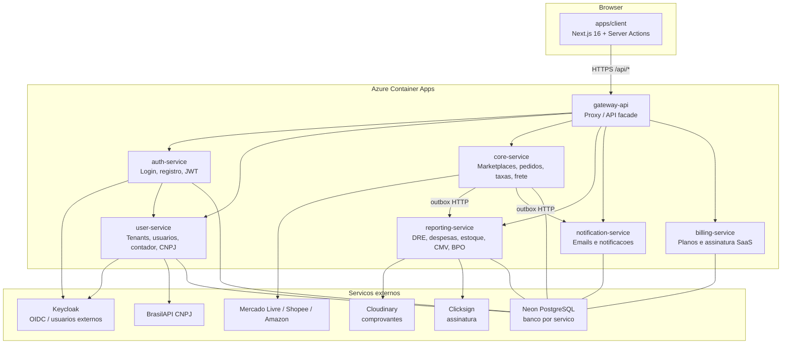
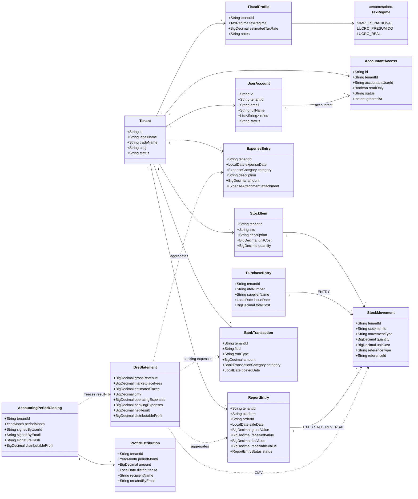
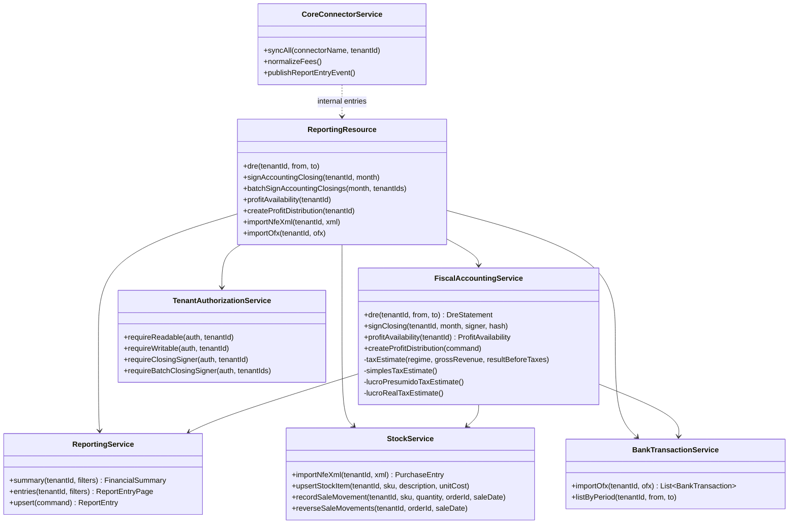
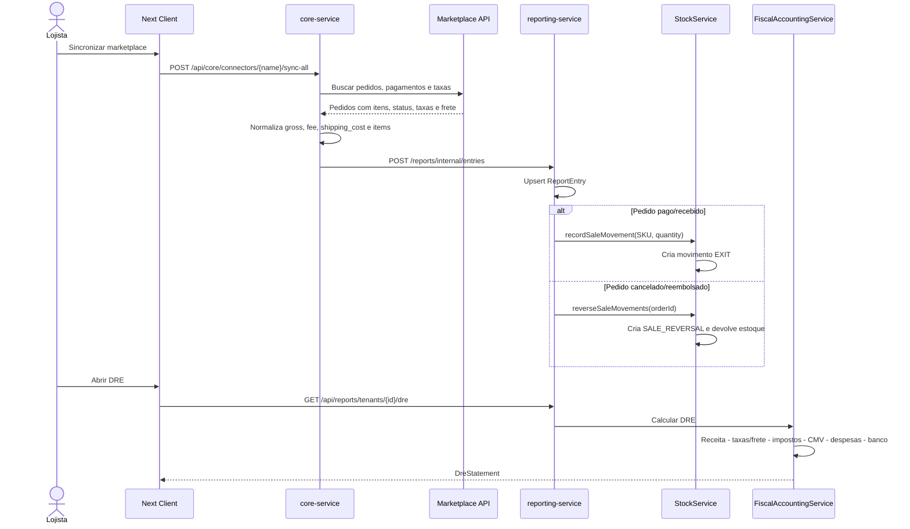
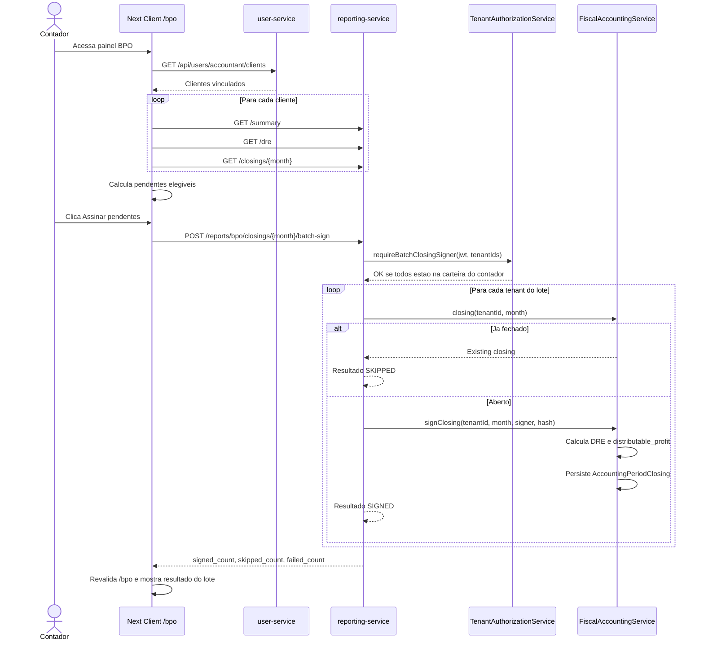
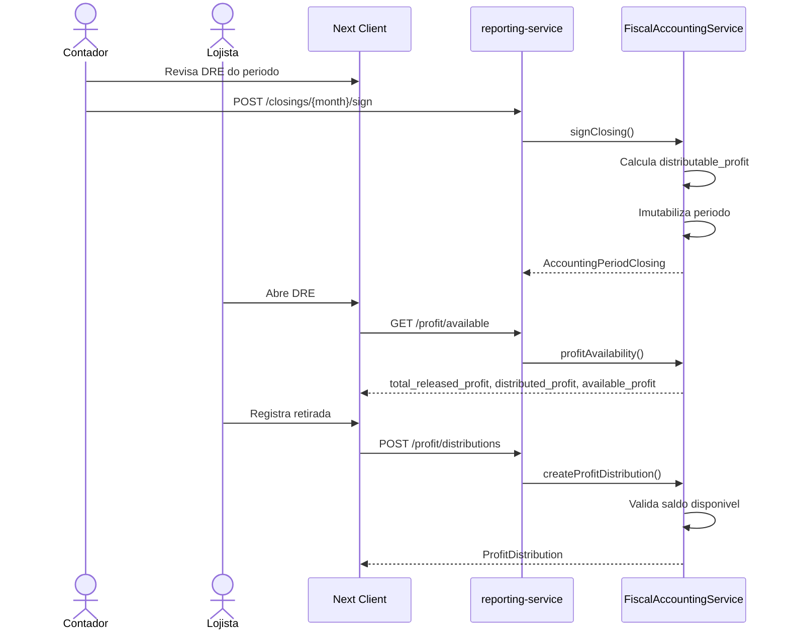
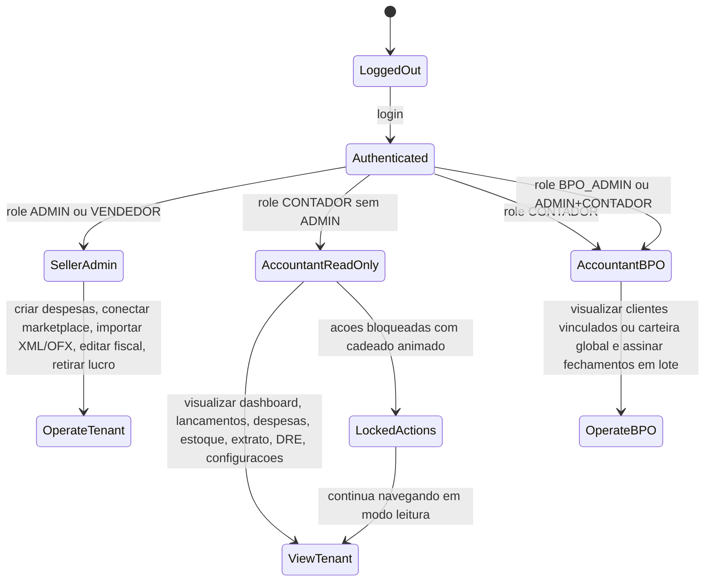

# Brasaller - Estado Atual Implementado e Planta UML

Atualizado em: 2026-06-08

Este documento consolida o que ja foi implementado no Brasaller e apresenta uma planta UML profissional do estado atual da plataforma. Ele deve ser usado como referencia para demonstracao ao cliente, alinhamento tecnico e proximas entregas.

## 1. Resumo Executivo

O Brasaller esta implementado como uma plataforma SaaS multi-tenant para lojistas de e-commerce e contadores. O produto ja entrega o nucleo contabil prometido: captura vendas, normaliza taxas/frete, apura despesas, calcula CMV, estima impostos por regime tributario, monta a DRE e libera lucro distribuivel apos fechamento/assinatura.

O diferencial demonstravel hoje e o funil contabil completo:

1. Marketplace envia venda e split financeiro.
2. Core padroniza receita, taxas e frete.
3. Reporting registra lancamentos, despesas, estoque, CMV e banco.
4. DRE calcula resultado liquido e lucro distribuivel.
5. Contador visualiza clientes no BPO e fecha periodos em lote.
6. Lojista visualiza lucro disponivel para distribuicao.

## 2. Estado Atual por Area

| Area | Status | Evidencia funcional |
|------|--------|---------------------|
| Marketplaces / vendas | Feito | Core sincroniza vendas e envia lancamentos normalizados ao Reporting. |
| Split de taxas e frete | Feito | Taxas e frete sao padronizados como custo de marketplace. Amazon, Mercado Livre e Shopee possuem normalizacao dedicada. |
| Despesas manuais | Feito | CRUD de despesas com comprovante obrigatorio. |
| Comprovantes | Feito | Upload de comprovantes via Cloudinary integrado as despesas. |
| OFX bancario | Feito/parcial | Importa OFX/QFX, categoriza debitos e soma despesas bancarias na DRE. Open Finance real ainda nao esta integrado. |
| Estoque / XML NF-e fornecedor | Feito | Upload de XML de fornecedor alimenta estoque, custo unitario e entradas de compra. |
| CMV por venda/SKU | Feito | Venda com item/SKU gera movimento `EXIT` e entra na linha de CMV da DRE. |
| Estorno CMV/estoque | Feito | `CANCELLED` e `REFUNDED` geram reversao `SALE_REVERSAL`, devolvendo estoque e abatendo CMV. |
| Estorno de receita cancelada | Feito | Canceladas/reembolsadas zeram receita, recebido, taxa e a receber nos agregados. |
| DRE | Feito | Calcula receita, taxas/frete, impostos, CMV, despesas, banco, resultado liquido e lucro distribuivel. |
| Regime tributario automatico | Feito | Simples Nacional, Lucro Presumido e Lucro Real calculam impostos automaticamente com aliquota efetiva. |
| Lucro disponivel | Feito | Fechamento assinado libera lucro; distribuicoes registradas consomem saldo disponivel. |
| Assinatura / fechamento | Feito/parcial | Fechamento contabil imutabiliza o periodo; Clicksign/webhook existem. ICP-Brasil A1/A3 nativo ainda nao. |
| Painel contador SaaS | Feito | Contador visualiza multiplos clientes vinculados. |
| BPO multi-cliente | Feito | Painel BPO lista clientes, DRE, status, assinatura em lote e carteira global para operador BPO interno (`BPO_ADMIN` ou `ADMIN` + `CONTADOR`). |
| Modo somente leitura do contador | Feito | Telas operacionais ficam visiveis, mas acoes de escrita aparecem bloqueadas com cadeado animado. |
| CNPJ / Receita Federal | Feito/parcial | Backend consulta BrasilAPI por CNPJ; tela de configuracoes consulta dados cadastrais. |
| API Nota Fiscal / SEFAZ | Falta | Ainda nao emite NF-e nem calcula imposto real por nota emitida. |
| Balanco Patrimonial | Falta | Ainda nao ha Ativo, Passivo e Patrimonio Liquido. |
| Webhooks marketplace | Falta/parcial | Cancelamentos e devolucoes entram por sync/conector; webhook real por marketplace ainda falta. |

## 3. Planta UML - Componentes

## 4. Planta UML - Dominio Contabil e BPO

## 5. Planta UML - Servicos e Casos de Uso

## 6. Sequencia - Venda com CMV e Estorno

## 7. Sequencia - BPO em Lote

## 8. Sequencia - Lucro Disponivel

## 9. Estado de Permissao do Contador

## 10. Regras de Demonstracao ao Cliente

Para demonstrar valor sem prometer itens ainda pendentes, use este roteiro:

1. Conectores: mostrar marketplace conectado e sync.
2. Lancamentos: mostrar vendas normalizadas com status.
3. Estoque: mostrar SKU, custo unitario e entrada via XML.
4. DRE: mostrar receita, taxas/frete, impostos automaticos, CMV, banco e lucro liquido.
5. Configuracoes: trocar regime tributario e observar aliquota efetiva na DRE.
6. Extrato: importar OFX e mostrar despesas bancarias entrando na DRE.
7. Fechamento: contador assina periodo.
8. Lucro disponivel: lojista visualiza saldo liberado e registra distribuicao.
9. BPO: contador acessa multiplos clientes e assina pendentes em lote.
10. Modo contador: abrir telas operacionais e mostrar cadeado animado bloqueando escrita.

## 11. Pendencias Tecnicas Relevantes

| Pendencia | Motivo | Prioridade |
|-----------|--------|------------|
| Balanco Patrimonial | Necessario para fechar ciclo contabil completo com Ativo, Passivo e PL. | Alta |
| NF-e/SEFAZ emissao real | Hoje o sistema usa XML/rastreio; nao emite nota nem calcula imposto por NF-e emitida. | Media/Alta |
| Open Finance real | OFX funciona, mas integracao bancaria automatica ainda falta. | Media |
| Webhooks marketplace em tempo real | Cancelamentos funcionam por sync/conector; webhook reduz latencia. | Media |
| ICP-Brasil A1/A3 nativo | Clicksign existe; assinatura nativa ainda nao. | Baixa/Media |

## 12. Observacoes de Deploy

Deploys recentes realizados:

| Servico | Mudanca | Status |
|---------|---------|--------|
| core-service | Padronizacao fina de taxas/frete por marketplace. | Deploy realizado. |
| reporting-service | Lucro disponivel, regime tributario automatico e calculo DRE atualizado. | Deploy realizado. |
| user-service/auth-service | CNPJ/BrasilAPI e ajustes de perfil externo. | Deploy backend realizado anteriormente. |
| apps/client | Bloqueio visual do contador e painel BPO em lote. | Implementado localmente; deploy deve ser feito quando aprovado. |
